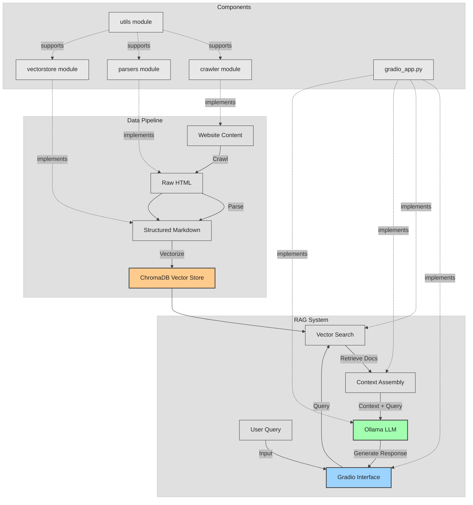

# Contributing to Tapio Assistant

Thank you for considering contributing to Tapio Assistant! This document provides guidelines and instructions for contributing to this project.

## Table of Contents

- [Contributing to Tapio Assistant](#contributing-to-tapio-assistant)
  - [Table of Contents](#table-of-contents)
  - [Technical Architecture](#technical-architecture)
  - [Development Environment Setup](#development-environment-setup)
    - [Prerequisites](#prerequisites)
    - [Using Dev Container (Recommended)](#using-dev-container-recommended)
    - [Using GitHub Codespaces (Cloud Alternative)](#using-github-codespaces-cloud-alternative)
    - [Manual Setup (Alternative)](#manual-setup-alternative)
    - [Installing Required Models](#installing-required-models)
  - [Package Management](#package-management)
  - [Code Quality](#code-quality)
    - [Ruff](#ruff)
    - [Type Checking](#type-checking)
    - [Pre-commit Hooks (prek)](#pre-commit-hooks-prek)
  - [Testing Guidelines](#testing-guidelines)
    - [Running Tests](#running-tests)
    - [Code Coverage](#code-coverage)
    - [Test Categories](#test-categories)
    - [Test Fixtures](#test-fixtures)
  - [Project Structure](#project-structure)
  - [Programmatic API](#programmatic-api)
    - [Using Factory Pattern (Recommended)](#using-factory-pattern-recommended)
    - [Manual Dependency Injection (Advanced)](#manual-dependency-injection-advanced)
    - [Key Components](#key-components)
  - [Configuration System](#configuration-system)
    - [Default Settings](#default-settings)
  - [Site Configurations](#site-configurations)
    - [Configuration Structure](#configuration-structure)
    - [Required vs Optional Fields](#required-vs-optional-fields)
    - [Adding New Sites](#adding-new-sites)
  - [Pull Request Process](#pull-request-process)

## Technical Architecture

Tapio is a RAG (Retrieval-Augmented Generation) application with three main parts:

1. **Data Pipeline**: Crawls, parses, and vectorizes web content
2. **RAG System**: Handles user queries, vector search, and LLM (Large Language Model) response generation
3. **Components**: The modules that implement the two parts above



## Development Environment Setup

### Prerequisites

Before starting development, ensure you have the following system tools installed:

- **Git**: For version control
- **Docker**: Required for dev container support (Docker Desktop recommended)
- **VS Code**: With the Dev Containers extension for dev container development

First, clone the repository:

```bash
git clone https://github.com/finntegrate/tapio.git
cd tapio
```

### Using Dev Container (Recommended)

This project includes a preconfigured development container that provides all necessary tools and dependencies.

**Requirements**: Docker must be installed on your system (Docker Desktop is recommended for ease of use).

If you're using VS Code:

1. Open the project in VS Code:

```bash
code .
```

1. VS Code will automatically detect the dev container configuration and prompt you to "Reopen in Container". Click this button to set up the development environment automatically.

The dev container includes:

- Python 3.14
- `uv` package manager
- Ollama for local LLM inference
- All required VS Code extensions (Python, Ruff, GitHub Copilot, etc.)
- Automatic dependency installation via `uv sync --dev`

### Using GitHub Codespaces (Cloud Alternative)

For a completely cloud-based development environment that requires no local setup:

[](https://codespaces.new/finntegrate/tapio?quickstart=1)

> [!WARNING]
> **Critical: Always stop your Codespace when not in use!**
>
> GitHub provides free Codespaces hours per month (typically 60-120 hours, subject to change). To avoid wasting your free hours:
>
> - **Manually stop your Codespace** every time you finish working
> - You can resume a stopped Codespace later, preserving all your work and changes
> - [Resume your most recent Codespace](https://codespaces.new/finntegrate/tapio?quickstart=1) for this repository

<!-- -->

> [!TIP]
> **How to stop your Codespace:**
>
> 1. Go to [github.com/codespaces](https://github.com/codespaces)
> 2. Find your active Codespace for this repository
> 3. Click the "..." menu and select "Stop codespace"

The Codespace includes the same development environment as the local dev container:

- Python 3.14, `uv` package manager, and Ollama
- All required VS Code extensions pre-installed
- Automatic dependency installation

### Manual Setup (Alternative)

If you prefer not to use the dev container or are using a different editor:

1. Install `uv` package manager:

```bash
curl -LsSf https://astral.sh/uv/install.sh | sh
```

1. Create and activate a virtual environment with uv:

```bash
uv venv
source .venv/bin/activate  # On Unix/macOS
# OR
.\.venv\Scripts\activate   # On Windows
```

1. Install dependencies:

```bash
uv sync --dev
```

1. Install Ollama for local LLM inference:
   - Follow the installation instructions at [ollama.ai](https://ollama.ai)

### Installing Required Models

Regardless of which setup method you chose, you'll need to install `llama3.2`, the base model this project uses for text generation:

```bash
ollama pull llama3.2
ollama list  # verify it installed
```

**Note on Model Sizes**: Some Ollama models are several GB and need significant disk space and compute. If your machine is limited, try a smaller variant instead, e.g. `ollama pull llama3.2:1b` or `ollama pull gemma3:1b`.

**Embedding Models**: Vectorization uses HuggingFace sentence-transformers (default: `all-MiniLM-L6-v2`), downloaded automatically on first use — no manual installation needed. Ollama's own embedding models (e.g. `all-minilm`) are not used by the current implementation.

## Package Management

We use the `uv` package manager for this project. To add packages:

```bash
uv add <package-name>
```

Do not use `pip`, `uv pip install`, or `uv pip install -e .` to install packages or this project.

To synchronize dependencies from the lockfile:

```bash
uv sync
```

## Code Quality

### Ruff

We use [Ruff](https://docs.astral.sh/ruff/) for linting and formatting. Please ensure your code passes all checks before submitting a pull request.

You can run the linter with the following command:

```bash
uv run ruff check .
```

You can also run the linter with the `--fix` option to automatically fix some issues:

```bash
uv run ruff check . --fix
```

### Type Checking

We run both [mypy](https://mypy-lang.org/) and [Pyrefly](https://pyrefly.org/) for static type checking. Both are enforced in CI (Continuous Integration), so run them locally before opening a pull request:

```bash
uv run mypy tapio
uv run pyrefly check
```

### Pre-commit Hooks (prek)

We use [prek](https://github.com/j178/prek), a drop-in replacement for `pre-commit`, to run formatting and linting checks automatically before each commit. Install the git hook once after cloning:

```bash
uv run prek install
```

To run all hooks against the full codebase (useful before submitting a pull request, or if you haven't installed the git hook):

```bash
uv run prek run --all-files
```

These are the same checks enforced in CI (excluding mypy and Pyrefly, which CI runs as separate steps against the project's own virtual environment).

## Testing Guidelines

### Running Tests

When adding features, always include appropriate tests. Run the entire test suite with:

```bash
uv run pytest
```

### Code Coverage

We require at least 80% test coverage for new code. Check coverage with:

```bash
uv run pytest --cov=tapio                          # terminal summary
uv run pytest --cov=tapio --cov-report=html        # HTML report in htmlcov/index.html
uv run pytest --cov=tapio.utils tests/utils/        # for a specific module
```

### Test Categories

We maintain different types of tests:

**Unit Tests** - Fast, isolated tests with mocked dependencies:

```bash
uv run pytest -m "not integration"
```

**Integration Tests** - Tests using real components (marked with `@pytest.mark.integration`):

```bash
uv run pytest -m integration
```

**All Tests**:

```bash
uv run pytest
```

### Test Fixtures

`tests/conftest.py` provides these common mock fixtures:

- `mock_embeddings` - Mocked HuggingFace embeddings
- `mock_chroma_store` - Mocked ChromaDB vector store
- `mock_llm_service` - Mocked LLM service
- `mock_doc_retrieval_service` - Mocked document retrieval service
- `mock_rag_orchestrator` - Mocked RAG orchestrator

Use these fixtures in your tests for consistent mocking:

```python
def test_my_feature(mock_rag_orchestrator):
    # Test uses mocked orchestrator
    pass
```

## Project Structure

Tapio separates concerns across these modules:

- `crawler/`: Module responsible for crawling websites and saving HTML content
- `parsers/`: Module responsible for parsing HTML content into structured formats
- `vectorstore/`: Module responsible for vectorizing content and storing in ChromaDB
- `services/`: RAG orchestration and LLM services
- `config/`: Configuration settings for the project
- `app.py`: Gradio interface for the RAG chatbot
- `cli.py`: Command-line interface
- `factories.py`: Factory classes for dependency injection
- `utils/`: Utility modules for embedding generation, markdown processing, etc.
- `tests/`: Test suite for all modules

## Programmatic API

For developers who want to use Tapio as a library or extend its functionality:

### Using Factory Pattern (Recommended)

```python
from tapio import RAGConfig, RAGOrchestratorFactory

# Create configuration
config = RAGConfig(
    collection_name="my_docs",
    persist_directory="./db",
    llm_model_name="llama3.2",
    max_tokens=1024,
    num_results=5
)

# Create orchestrator using factory
factory = RAGOrchestratorFactory(config)
orchestrator = factory.create_orchestrator()

# Query the system
response, documents = orchestrator.query("What are the visa requirements?")
print(response)
```

### Manual Dependency Injection (Advanced)

For full control over component creation:

```python
from langchain_huggingface import HuggingFaceEmbeddings
from tapio.vectorstore.chroma_store import ChromaStore
from tapio.services.document_retrieval_service import DocumentRetrievalService
from tapio.services.llm_service import LLMService
from tapio.services.rag_orchestrator import RAGOrchestrator

# Create dependencies
embeddings = HuggingFaceEmbeddings(model_name="all-MiniLM-L6-v2")
chroma_store = ChromaStore("my_docs", embeddings, "./db")
doc_service = DocumentRetrievalService(chroma_store, num_results=5)
llm_service = LLMService(model_name="llama3.2", max_tokens=1024)

# Create orchestrator
orchestrator = RAGOrchestrator(doc_service, llm_service)
```

### Key Components

- **RAGOrchestrator**: Main orchestrator that coordinates document retrieval and LLM generation
- **DocumentRetrievalService**: Handles vector-based document retrieval
- **LLMService**: Manages LLM interactions via Ollama
- **ChromaStore**: Vector database abstraction layer
- **Factories**: Simplify dependency wiring with sensible defaults

## Configuration System

The application uses a centralized configuration system:

- `config/settings.py`: Contains global configuration settings used across different components
- `config/site_configs.yaml`: Site-specific parser configurations
- `config/config_models.py`: Pydantic models for configuration
- `config/config_manager.py`: Central manager for accessing configurations

When adding new features that require configuration values:

1. Use existing settings from `DEFAULT_DIRS` when possible
2. For new configuration needs, add them to the appropriate config file
3. Avoid hardcoding values that might need to change in the future
4. Use descriptive keys for configuration values

### Default Settings

Centralized configuration in `tapio/config/settings.py`:

```python
DEFAULT_DIRS = {
    "CRAWLED_DIR": "content/crawled",   # HTML storage
    "PARSED_DIR": "content/parsed",     # Markdown storage
    "CHROMA_DIR": "chroma_db",          # Vector database
}

DEFAULT_CHROMA_COLLECTION = "tapio"     # ChromaDB collection name
DEFAULT_EMBEDDING_MODEL = "all-MiniLM-L6-v2"
DEFAULT_LLM_MODEL = "llama3.2"
DEFAULT_MAX_TOKENS = 1024
DEFAULT_NUM_RESULTS = 5
```

## Site Configurations

Site configurations define how to crawl and parse specific websites. They're stored in `tapio/config/site_configs.yaml` and used by both crawl and parse commands. Selectors below use XPath, a query language for selecting elements in HTML/XML documents.

### Configuration Structure

```yaml
sites:
  migri:
    base_url: "https://migri.fi"                # Used for crawling and converting relative links
    description: "Finnish Immigration Service website"
    crawler_config:                            # Crawling behavior
      delay_between_requests: 1.0              # Seconds between requests
      max_concurrent: 3                        # Concurrent request limit
    parser_config:                              # Parser-specific configuration
      title_selector: "//title"                # XPath for page titles
      content_selectors:                       # Priority-ordered content extraction
        - '//div[@id="main-content"]'
        - "//main"
        - "//article"
        - '//div[@class="content"]'
      fallback_to_body: true                   # Use <body> if selectors fail
      markdown_config:                         # HTML-to-Markdown options
        ignore_links: false
        body_width: 0                          # No text wrapping
        protect_links: true
        unicode_snob: true
        ignore_images: false
        ignore_tables: false
```

### Required vs Optional Fields

**Required:**

- `base_url` - Base URL for the site (used for crawling and link resolution)

**Optional (with defaults):**

- `description` - Human-readable description
- `parser_config` - Parser-specific settings (uses defaults if omitted)
  - `title_selector` - Page title XPath (default: "//title")
  - `content_selectors` - XPath selectors for content extraction (default: ["//main", "//article", "//body"])
  - `fallback_to_body` - Use full-body content if selectors fail (default: true)
  - `markdown_config` - HTML conversion settings (uses defaults if omitted)
- `crawler_config` - Crawling behavior settings (uses defaults if omitted)
  - `delay_between_requests` - Delay between requests in seconds (default: 1.0)
  - `max_concurrent` - Maximum concurrent requests (default: 5)

### Adding New Sites

1. Analyze the target website's structure and identify XPath selectors for its content
2. Add an entry to `site_configs.yaml` following the structure above — only `base_url` is required
3. Run the workflow against the new site by name:

```bash
uv run -m tapio.cli crawl my_site
uv run -m tapio.cli parse my_site
uv run -m tapio.cli vectorize
uv run -m tapio.cli tapio-app
```

## AI-assisted development with Claude Code

This project ships Claude Code project commands that make issue management and backlog review available as slash commands inside any Claude Code session.

### Claude Code Prerequisites

Install Claude Code (the CLI) or the Claude Code extension for VS Code:

```bash
npm install -g @anthropic-ai/claude-code   # CLI
```

Or install the [Claude Code VS Code extension](https://marketplace.visualstudio.com/items?itemName=Anthropic.claude-code) from the marketplace.

### How commands activate

No manual configuration is needed. When you open this repository in Claude Code, it automatically discovers skills under `.claude/skills/` and registers them as slash commands. If the commands don't appear immediately, **restart Claude Code once** — live change detection requires a restart when the watched directory is new.

You can also let Claude invoke the `backlog` skill automatically: if you ask about what's planned or whether something already exists as an issue, Claude will use it without you typing a slash command.

### Available commands

| Command | Usage |
|---|---|
| `/create-issue <description>` | Draft and create a single GitHub issue from a free-form description. Claude scans the backlog for related issues first, derives labels and a checklist, and asks you to confirm before creating. |
| `/create-issue <path/to/file.yaml>` | Batch-create issues from a YAML planning file (see `.claude/skills/create-issue/references/issue-schema.yaml` for the schema). |
| `/backlog` | Full backlog review grouped by area label. |
| `/backlog <keyword>` | Search open issues for a topic and read related issue bodies. |
| `/backlog <issue number>` | Deep dive on a single issue with related issues surfaced. |
| `/backlog <label>` | Area review — all open issues for a given label with a PM-style summary. |
| `/backlog gaps` | Coverage analysis — identify under-planned areas and potential consolidations. |

### Planning new issues in YAML

When you want to brainstorm a batch of issues before pushing them to GitHub, create a file following `.claude/skills/create-issue/references/issue-schema.yaml` and pass it to `/create-issue`. GitHub is the source of truth; the YAML file is a temporary planning scratchpad and does not need to be committed.

## Pull Request Process

1. Update the README.md with details of changes to the interface, if appropriate.
2. Run `uv run pytest`, `uv run prek run --all-files`, `uv run mypy tapio`, and `uv run pyrefly check` locally — these are all gated checks in CI, not just local conveniences.
3. Check that code coverage meets our standards (minimum 80%).
4. Submit your pull request with a clear description of the changes, related issue numbers, and any special considerations.
5. The pull request will be merged once it receives approval from the maintainers and all CI checks pass.
