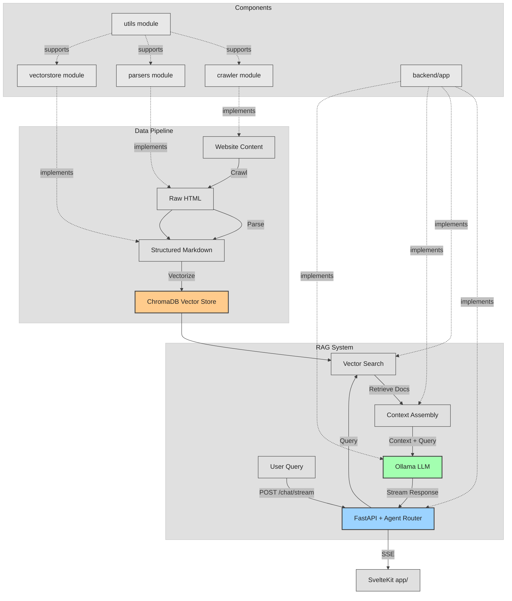

# Contributing to Tapio Assistant

Thank you for considering contributing to Tapio Assistant! This document provides guidelines and instructions for contributing to this project.

## Table of Contents

- [Contributing to Tapio Assistant](#contributing-to-tapio-assistant)
  - [Table of Contents](#table-of-contents)
  - [Technical Architecture](#technical-architecture)
  - [Development Environment Setup](#development-environment-setup)
    - [Prerequisites](#prerequisites)
    - [Using Dev Container (Recommended)](#using-dev-container-recommended)
    - [Using GitHub Codespaces (Cloud Alternative)](#using-github-codespaces-cloud-alternative)
    - [Manual Setup (Alternative)](#manual-setup-alternative)
    - [Installing Required Models](#installing-required-models)
  - [Package Management](#package-management)
  - [Code Quality](#code-quality)
    - [Ruff](#ruff)
    - [Type Checking](#type-checking)
    - [Pre-commit Hooks (prek)](#pre-commit-hooks-prek)
  - [Testing Guidelines](#testing-guidelines)
    - [Running Tests](#running-tests)
    - [Code Coverage](#code-coverage)
    - [Test Categories](#test-categories)
    - [Test Fixtures](#test-fixtures)
  - [Project Structure](#project-structure)
  - [Programmatic API](#programmatic-api)
    - [Using Factory Pattern (Recommended)](#using-factory-pattern-recommended)
    - [Manual Dependency Injection (Advanced)](#manual-dependency-injection-advanced)
    - [Key Components](#key-components)
  - [Configuration System](#configuration-system)
    - [Backend Settings](#backend-settings)
    - [Default Settings](#default-settings)
  - [Site Configurations](#site-configurations)
    - [Configuration Structure](#configuration-structure)
    - [Required vs Optional Fields](#required-vs-optional-fields)
    - [Adding New Sites](#adding-new-sites)
  - [Pull Request Process](#pull-request-process)

## Technical Architecture

Tapio is a RAG (Retrieval-Augmented Generation) application with three main parts:

1. **Data Pipeline**: Crawls, parses, and vectorizes web content
2. **RAG System**: Handles user queries, vector search, and LLM (Large Language Model) response generation
3. **Components**: The modules that implement the two parts above


```mermaid
%%{init: {'theme': 'base', 'themeVariables': { 'primaryColor': '#f0f0f0', 'primaryTextColor': '#323232', 'primaryBorderColor': '#606060', 'lineColor': '#404040', 'secondaryColor': '#c0c0c0', 'tertiaryColor': '#e0e0e0' }}}%%
graph TD
    subgraph Data Pipeline
        A[Website Content] -->|Crawl| B[Raw HTML]
        B -->|Parse| C[Structured Markdown]
        C -->|Vectorize| D[ChromaDB Vector Store]
    end

    subgraph RAG System
        E[User Query] -->|POST /chat/stream| F[FastAPI + Agent Router]
        F -->|Query| G[Vector Search]
        G -->|Retrieve Docs| H[Context Assembly]
        H -->|Context + Query| I[Ollama LLM]
        I -->|Stream Response| F
    end

    D --> G
    F -->|SSE| Svelte[SvelteKit app/]

    subgraph Components
        J[crawler module] -.->|implements| A
        K[parsers module] -.->|implements| B --> C
        L[vectorstore module] -.->|implements| C
        M[utils module] -.->|supports| J & K & L
        N[backend/app] -.->|implements| F & G & H & I
    end

    classDef neutral fill:#e0e0e0,stroke:#404040,stroke-width:1px,color:#232323
    classDef component fill:#e8e8e8,stroke:#404040,stroke-width:1px,color:#232323
    classDef vectorstore fill:#ffcb8c,stroke:#404040,stroke-width:2px,color:#232323
    classDef api fill:#9cd3ff,stroke:#404040,stroke-width:2px,color:#232323
    classDef ollama fill:#a3ffb0,stroke:#404040,stroke-width:2px,color:#232323
    class A,B,C,E,G,H,Svelte neutral
    class J,K,L,M,N component
    class D vectorstore
    class F api
    class I ollama
```

## Development Environment Setup

### Prerequisites

Before starting development, ensure you have the following system tools installed:

- **Git**: For version control
- **Docker**: Required for dev container support (Docker Desktop recommended)
- **VS Code**: With the Dev Containers extension for dev container development

First, clone the repository:

```bash
git clone https://github.com/finntegrate/tapio.git
cd tapio
```

### Using Dev Container (Recommended)

This project includes a preconfigured development container that provides all necessary tools and dependencies.

**Requirements**: Docker must be installed on your system (Docker Desktop is recommended for ease of use).

If you're using VS Code:

1. Open the project in VS Code:

```bash
code .
```

1. VS Code will automatically detect the dev container configuration and prompt you to "Reopen in Container". Click this button to set up the development environment automatically.

The dev container includes:

- Python 3.14
- `uv` package manager
- Ollama for local LLM inference
- [`mise`](https://mise.jdx.dev/), which manages `actionlint` and `markdownlint-cli2` (used by two of the prek hooks below)
- All required VS Code extensions (Python, Ruff, GitHub Copilot, etc.)
- Automatic dependency installation (`uv sync --dev`) and tool installation (`mise install`)

### Using GitHub Codespaces (Cloud Alternative)

For a completely cloud-based development environment that requires no local setup:

[](https://codespaces.new/finntegrate/tapio?quickstart=1)

> [!WARNING]
> **Critical: Always stop your Codespace when not in use!**
>
> GitHub provides free Codespaces hours per month (typically 60-120 hours, subject to change). To avoid wasting your free hours:
>
> - **Manually stop your Codespace** every time you finish working
> - You can resume a stopped Codespace later, preserving all your work and changes
> - [Resume your most recent Codespace](https://codespaces.new/finntegrate/tapio?quickstart=1) for this repository

<!-- -->

> [!TIP]
> **How to stop your Codespace:**
>
> 1. Go to [github.com/codespaces](https://github.com/codespaces)
> 2. Find your active Codespace for this repository
> 3. Click the "..." menu and select "Stop codespace"

The Codespace includes the same development environment as the local dev container:

- Python 3.14, `uv` package manager, Ollama, and `mise`
- All required VS Code extensions pre-installed
- Automatic dependency and tool installation

### Manual Setup (Alternative)

If you prefer not to use the dev container or are using a different editor:

1. Install `uv` package manager:

```bash
curl -LsSf https://astral.sh/uv/install.sh | sh
```

1. Create and activate a virtual environment with uv:

```bash
uv venv
source .venv/bin/activate  # On Unix/macOS
# OR
.\.venv\Scripts\activate   # On Windows
```

1. Install dependencies:

```bash
uv sync --dev
```

1. Install Ollama for local LLM inference:
   - Follow the installation instructions at [ollama.ai](https://ollama.ai)

1. Install [`mise`](https://mise.jdx.dev/), which manages the versions of `actionlint` and `markdownlint-cli2` used by two of the prek hooks below (without it, those two hooks fail with "command not found"):

```bash
curl https://mise.run | sh
mise install   # installs the tool versions pinned in mise.toml
```

### Installing Required Models

Regardless of which setup method you chose, you'll need to install `gemma4:latest`, the default model this project uses for text generation:

```bash
ollama pull gemma4:latest
ollama list  # verify it installed
```

**Note on Model Sizes**: Some Ollama models are several GB and need significant disk space and compute. If your machine is limited, pull a smaller model and pass its name explicitly to the Tapio CLI.

**Embedding Models**: Vectorization uses HuggingFace sentence-transformers (default: `all-MiniLM-L6-v2`), downloaded automatically on first use — no manual installation needed. Ollama's own embedding models (e.g. `all-minilm`) are not used by the current implementation.

## Package Management

We use the `uv` package manager for this project. To add packages:

```bash
uv add <package-name>
```

Do not use `pip`, `uv pip install`, or `uv pip install -e .` to install packages or this project.

To synchronize dependencies from the lockfile:

```bash
uv sync
```

## Code Quality

### Ruff

We use [Ruff](https://docs.astral.sh/ruff/) for linting and formatting. Please ensure your code passes all checks before submitting a pull request.

You can run the linter with the following command:

```bash
uv run ruff check .
```

You can also run the linter with the `--fix` option to automatically fix some issues:

```bash
uv run ruff check . --fix
```

### Type Checking

Each service runs [mypy](https://mypy-lang.org/) and [Pyrefly](https://pyrefly.org/) from its own project directory. Both are enforced in CI (Continuous Integration), so run them locally before opening a pull request:

```bash
uv run --directory crawler mypy --config-file mypy.ini tapio_crawler
uv run --directory crawler pyrefly check
uv run --directory ingest mypy tapio_ingest
uv run --directory ingest pyrefly check
uv run --directory backend mypy --config-file mypy.ini app
uv run --directory backend pyrefly check
```

### Pre-commit Hooks (prek)

We use [prek](https://github.com/j178/prek), a drop-in replacement for `pre-commit`, to run formatting and linting checks automatically before each commit. `prek` itself is a `backend/` dev dependency; install the git hook once after cloning:

```bash
uv run --directory backend prek install
```

To run all hooks against the full codebase (useful before submitting a pull request, or if you haven't installed the git hook):

```bash
uv run --directory backend prek run --all-files
```

These are the same checks enforced in CI. Two of the hooks (`actionlint`, `markdownlint-cli2`) run through `mise exec --` and require [`mise`](https://mise.jdx.dev/) to be installed and have run `mise install` once — see [Manual Setup](#manual-setup-alternative) if you're missing it.

## Testing Guidelines

### Running Tests

Each service (`crawler/`, `ingest/`, `backend/`) has its own test suite. When adding features, always include appropriate tests. Run a service's tests from its directory:

```bash
uv run --directory crawler pytest
uv run --directory ingest pytest
uv run --directory backend pytest
```

Or via `mise` from the repo root: `mise run test:crawl`, `mise run test:ingest`, `mise run test:backend`.

### Code Coverage

We require at least 80% test coverage for new code. Check coverage with:

```bash
uv run --directory backend pytest --cov=app                          # terminal summary
uv run --directory backend pytest --cov=app --cov-report=html        # HTML report in backend/htmlcov/index.html
uv run --directory backend pytest --cov=app.services tests/services/ # for a specific module
```

Swap `--directory backend` / `--cov=app` for `--directory crawler` / `--cov=tapio_crawler` or `--directory ingest` / `--cov=tapio_ingest` to check the other services.

### Test Categories

We maintain different types of tests:

**Unit Tests** - Fast, isolated tests with mocked dependencies:

```bash
uv run --directory backend pytest -m "not integration"
```

**Integration Tests** - Tests using real components (marked with `@pytest.mark.integration`):

```bash
uv run --directory backend pytest -m integration
```

**All Tests**:

```bash
uv run --directory backend pytest
```

### Test Fixtures

`backend/tests/conftest.py` provides these common fixtures:

- `mock_embeddings` - Mocked HuggingFace embeddings
- `mock_chroma_store` - Mocked `ChromaRetriever`
- `mock_llm_service` - Mocked LLM service
- `mock_doc_retrieval_service` - Mocked document retrieval service
- `mock_rag_orchestrator` - Mocked RAG orchestrator, for route/API tests
- `fake_agent_router` - Real `AgentRouter` (deterministic, safe to use unmocked)
- `client` - FastAPI `TestClient` with the orchestrator/router dependencies overridden

Use these fixtures in your tests for consistent mocking:

```python
def test_my_feature(mock_rag_orchestrator):
    # Test uses mocked orchestrator
    pass
```

## Project Structure

The repository is a monorepo of independently-managed projects (see [ADR 0002](docs/ADRs/0002-monorepo-service-split.md) and [ADR 0006](docs/ADRs/0006-retire-gradio.md)):

- `crawler/`: Crawls configured sites and writes Markdown with `source_url` frontmatter
- `ingest/`: Chunks and embeds that Markdown into the shared `vectorstore/` collection
- `backend/`: Owns the RAG/agent-routing orchestration and exposes it as a FastAPI HTTP/SSE API. Within `backend/app/`:
  - `agents/`: Guide definitions and routing logic
  - `services/`: RAG orchestration and LLM services
  - `config/`: Configuration settings
  - `prompts/`: Prompt templates (shared + per-guide)
  - `retrieval.py`, `factories.py`: Vector-store client and dependency wiring
  - `routes/`, `main.py`, `streaming.py`, `schemas.py`: The FastAPI application itself
- `app/`: The SvelteKit chat client that calls `backend/`
- `tests/` (within each project): Test suite for that project's modules

## Programmatic API

For developers who want to use the RAG/agent orchestration as a library, independent of the HTTP API — for example in a notebook or a script:

### Using Factory Pattern (Recommended)

```python
from app import RAGConfig, RAGOrchestratorFactory

# Create configuration
config = RAGConfig(
    collection_name="my_docs", persist_directory="./db", llm_model_name="gemma4:latest", max_tokens=1024, num_results=5
)

# Create orchestrator using factory
factory = RAGOrchestratorFactory(config)
orchestrator = factory.create_orchestrator()

# Query the system
response, documents = orchestrator.query("What are the visa requirements?")
print(response)
```

### Manual Dependency Injection (Advanced)

For full control over component creation:

```python
from langchain_huggingface import HuggingFaceEmbeddings
from app.retrieval import ChromaRetriever
from app.services.document_retrieval_service import DocumentRetrievalService
from app.services.llm_service import LLMService
from app.services.rag_orchestrator import RAGOrchestrator

# Create dependencies
embeddings = HuggingFaceEmbeddings(model_name="all-MiniLM-L6-v2")
chroma_store = ChromaRetriever("my_docs", embeddings, "./db")
doc_service = DocumentRetrievalService(chroma_store, num_results=5)
llm_service = LLMService(model_name="gemma4:latest", max_tokens=1024)

# Create orchestrator
orchestrator = RAGOrchestrator(doc_service, llm_service)
```

### Key Components

- **RAGOrchestrator**: Main orchestrator that coordinates document retrieval and LLM generation
- **DocumentRetrievalService**: Handles vector-based document retrieval
- **LLMService**: Manages LLM interactions via Ollama
- **ChromaRetriever**: Vector database abstraction layer
- **Factories**: Simplify dependency wiring with sensible defaults

## Configuration System

Configuration is split per service, matching the monorepo layout ([ADR 0002](docs/ADRs/0002-monorepo-service-split.md), [ADR 0006](docs/ADRs/0006-retire-gradio.md)):

- `backend/app/config/` — settings for the RAG pipeline and the FastAPI process itself
- `crawler/tapio_crawler/config/` — settings for site collection (see [Site Configurations](#site-configurations) below)

**`backend/app/config/`:**

- `settings.py` — module-level defaults for the RAG pipeline (`DEFAULT_CHROMA_COLLECTION`, `DEFAULT_VECTORSTORE_DIR`, `DEFAULT_EMBEDDING_MODEL`, `DEFAULT_LLM_MODEL`, `DEFAULT_MAX_TOKENS`, `DEFAULT_NUM_RESULTS`)
- `config_models.py` — `RAGConfig`, a dataclass built from those defaults
- `backend_settings.py` — `BackendSettings`, a `pydantic-settings` model for the FastAPI process (host, port, CORS)

When adding new features that require configuration values:

1. Prefer extending `RAGConfig` or `BackendSettings` over inventing a new config object.
2. Add new defaults to `settings.py` rather than hardcoding values in application code.
3. `BackendSettings` fields are overridable via `TAPIO_BACKEND_*` environment variables; keep new fields consistent with that prefix.

### Backend Settings

`BackendSettings` (`backend/app/config/backend_settings.py`) configures the FastAPI process itself — the interface uvicorn binds to, and which origins may call the API:

```python
class BackendSettings(BaseSettings):
    model_config = SettingsConfigDict(env_prefix="TAPIO_BACKEND_")

    host: str = "127.0.0.1"
    port: int = 8000
    cors_origins: list[str] = ["http://localhost:5173"]
```

Values are read from environment variables prefixed `TAPIO_BACKEND_` — for example, `TAPIO_BACKEND_PORT=9000` overrides the port. `cors_origins` defaults to the SvelteKit dev server origin.

### Default Settings

`RAGConfig` (`backend/app/config/config_models.py`) is built from the defaults in `backend/app/config/settings.py`:

```python
DEFAULT_CHROMA_COLLECTION = "tapio_knowledge"
DEFAULT_VECTORSTORE_DIR = os.environ.get(
    "TAPIO_VECTORSTORE_DIR",
    str(Path(__file__).resolve().parents[3] / "vectorstore"),
)
DEFAULT_EMBEDDING_MODEL = "all-MiniLM-L6-v2"
DEFAULT_LLM_MODEL = "gemma4:latest"
DEFAULT_MAX_TOKENS = 1024
DEFAULT_NUM_RESULTS = 5
```

`DEFAULT_VECTORSTORE_DIR` defaults to the monorepo's shared `vectorstore/` directory (populated by `ingest/`, see [ADR 0004](docs/ADRs/0004-cocoindex-ingestion.md)) and is overridable via `TAPIO_VECTORSTORE_DIR`.

## Site Configurations

Site configurations define how the crawler service collects and normalizes content from a source website. They're owned by the `crawler/` project, stored in `crawler/tapio_crawler/config/site_configs.yaml`, and loaded via `ConfigManager` (`crawler/tapio_crawler/config/config_manager.py`). Collection runs on [Crawl4AI](docs/ADRs/0003-crawl4ai-crawler.md), so the configurable settings are Crawl4AI job parameters — there's no separate HTML-parsing stage or XPath selectors to configure.

### Configuration Structure

```yaml
sites:
  migri:
    base_url: "https://migri.fi" # Used for crawling and resolving relative links
    description: "Finnish Immigration Service website"
    crawler_config: # Crawl4AI job settings
      max_depth: 1 # Link-following depth from the base URL
      max_pages: 50 # Page budget for the crawl
      page_timeout: 30 # Seconds before a page load times out
      min_delay: 1.0 # Minimum seconds between requests
      max_delay: 3.0 # Maximum seconds between requests (randomized within this range)
      max_concurrent: 3 # Concurrent request limit
      recrawl_interval_hours: 720 # Minimum hours between recrawls of this site
      minimum_content_length: 100 # Discard pages with less extracted content than this
      css_selector: null # Optional CSS selector scoping extraction
      target_elements: [] # Optional list of elements for Crawl4AI to target
      remove_consent_popups: true # Strip cookie/consent banners before extraction
      remove_overlay_elements: true # Strip modal/overlay elements before extraction
      markdown_config: # HTML-to-Markdown options
        ignore_links: false
        body_width: 0 # No text wrapping
        protect_links: true
        unicode_snob: true
        ignore_images: false
        ignore_tables: false
```

### Required vs Optional Fields

**Required:**

- `base_url` - Base URL for the site (used for crawling and link resolution)

**Optional (with defaults):**

- `description` - Human-readable description
- `crawler_config` - Crawl4AI job settings (uses `CrawlerConfig` defaults if omitted); every field within it is itself optional:
  - `max_depth` (default: 1), `max_pages` (default: 50), `page_timeout` (default: 30)
  - `min_delay` (default: 1.0), `max_delay` (default: 3.0), `max_concurrent` (default: 3)
  - `recrawl_interval_hours` (default: 720), `minimum_content_length` (default: 100)
  - `css_selector` (default: none), `target_elements` (default: empty list)
  - `remove_consent_popups` / `remove_overlay_elements` (default: false)
  - `markdown_config` - HTML-to-Markdown conversion options (uses `MarkdownConfig` defaults if omitted)

### Adding New Sites

1. Add an entry to `crawler/tapio_crawler/config/site_configs.yaml` — only `base_url` is required.
2. Confirm it's picked up:

   ```bash
   cd crawler
   uv run tapio-crawler list-sites
   ```

3. Run the pipeline for the new site:

   ```bash
   uv run tapio-crawler crawl my_site                                   # crawler/: collect + normalize to Markdown
   cd ../ingest && uv run tapio-ingest                                  # ingest/: vectorize into the shared vector store
   cd ../backend && uv run uvicorn app.main:app --reload --port 8000    # backend/: serve the API
   ```

   Or via `mise` from the repo root: `mise run crawl` (all configured sites), `mise run ingest`, `mise run backend`.

## AI-assisted development with Claude Code

This project ships Claude Code project commands that make issue management and backlog review available as slash commands inside any Claude Code session.

### Claude Code Prerequisites

Install Claude Code (the CLI) or the Claude Code extension for VS Code:

```bash
npm install -g @anthropic-ai/claude-code   # CLI
```

Or install the [Claude Code VS Code extension](https://marketplace.visualstudio.com/items?itemName=Anthropic.claude-code) from the marketplace.

### How commands activate

No manual configuration is needed. When you open this repository in Claude Code, it automatically discovers skills under `.claude/skills/` and registers them as slash commands. If the commands don't appear immediately, **restart Claude Code once** — live change detection requires a restart when the watched directory is new.

You can also let Claude invoke the `backlog` skill automatically: if you ask about what's planned or whether something already exists as an issue, Claude will use it without you typing a slash command.

### Available commands

| Command | Usage |
|---|---|
| `/create-issue <description>` | Draft and create a single GitHub issue from a free-form description. Claude scans the backlog for related issues first, derives labels and a checklist, and asks you to confirm before creating. |
| `/create-issue <path/to/file.yaml>` | Batch-create issues from a YAML planning file (see `.claude/skills/create-issue/references/issue-schema.yaml` for the schema). |
| `/backlog` | Full backlog review grouped by area label. |
| `/backlog <keyword>` | Search open issues for a topic and read related issue bodies. |
| `/backlog <issue number>` | Deep dive on a single issue with related issues surfaced. |
| `/backlog <label>` | Area review — all open issues for a given label with a PM-style summary. |
| `/backlog gaps` | Coverage analysis — identify under-planned areas and potential consolidations. |

### Planning new issues in YAML

When you want to brainstorm a batch of issues before pushing them to GitHub, create a file following `.claude/skills/create-issue/references/issue-schema.yaml` and pass it to `/create-issue`. GitHub is the source of truth; the YAML file is a temporary planning scratchpad and does not need to be committed.

## Pull Request Process

1. Update the README.md with details of changes to the interface, if appropriate.
2. Run each service's tests and the type-check commands above, plus `uv run --directory backend prek run --all-files`, locally — these are all gated checks in CI, not just local conveniences.
3. Check that code coverage meets our standards (minimum 80%).
4. Submit your pull request with a clear description of the changes, related issue numbers, and any special considerations.
5. The pull request will be merged once it receives approval from the maintainers and all CI checks pass.
