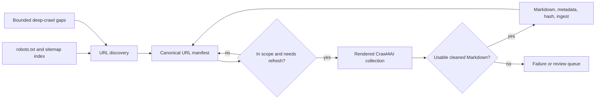

# Crawler improvements — feature specification

**Status:** Proposed
**Owner:** Finntegrate
**Related architecture:** [ADR 0003](../ADRs/0003-crawl4ai-crawler.md), [ADR 0004](../ADRs/0004-cocoindex-ingestion.md)

## Problem statement

Tapio needs a trustworthy and reasonably complete corpus of public guidance from
Finnish government services, including Migri, Kela, Vero, DVV, and
Työmarkkinatori. The current Crawl4AI implementation intentionally limits every
site to a one-link-deep, 50-page crawl and records one site-wide successful crawl
timestamp. This is safe for a proof of concept, but it cannot cover sites whose
guidance is distributed across years of pages, arbitrary navigation depths, and
multiple language sections.

A partially collected corpus creates a material user risk: a retrieval answer may
omit relevant official guidance and appear complete. The crawler must therefore
give operators measurable coverage, controlled incremental refreshes, and a way to
exclude irrelevant or private service flows without discarding useful long-tail
guidance.

## Source survey (2026-08-04)

Before committing to a sitemap-first design, we checked `robots.txt` and
`sitemap.xml` live for all five currently configured sources. The results
directly shape several requirements below: sitemap availability, shape, and
`lastmod` trustworthiness are not uniform across sources, and two sources
declare a `Crawl-delay` that our current configuration does not honor.

| Source | Sitemap | Shape | `lastmod` | Declared `Crawl-delay` |
| --- | --- | --- | --- | --- |
| migri.fi | `sitemap.xml` (via robots.txt) | `sitemapindex` with ~800 child sitemaps, one per Liferay page layout (`?p_l_id=...&layoutUuid=...&groupId=...`), ~4 URLs each (one per language variant) | Present but static — sampled entries all read `2018-03-05T09:50:42+02:00`, indistinguishable from a template constant | 5s |
| dvv.fi | `sitemap.xml` (via robots.txt) | Same Liferay `sitemapindex`-of-layouts pattern as migri, ~700 child sitemaps | Present but static — sampled entries all read `2020-10-08T17:39:34+03:00` | 5s |
| kela.fi | `sitemap.xml` (via robots.txt) | Flat `urlset`, ~850 URLs, clean paths | Present, varies per URL | none declared |
| vero.fi | `sitemap.xml` (via robots.txt) | Flat `urlset`, ~1,000+ URLs, clean paths | Present, varies per URL | none declared |
| tyomarkkinatori.fi | **None** — no `Sitemap:` line in `robots.txt`, `/sitemap.xml` returns 404 | n/a | n/a | none declared |

Implications carried into the sections below:

- **Sitemap availability is per-source, not universal.** tyomarkkinatori.fi has
  no sitemap at all, so bounded deep-crawl cannot be a secondary "gap detector"
  for it — it is the only discovery mechanism available. Discovery mode must be
  a per-site configuration choice, not a single global sequence.
- **Sitemap `lastmod` is not always a live change signal.** migri.fi and
  dvv.fi's `lastmod` values look like a fixed per-layout publish timestamp from
  their shared Liferay CMS, not a per-page content-change signal. A
  `lastmod`-driven refresh trigger cannot be trusted without first checking, per
  source, whether the values actually vary in a way that correlates with real
  content changes.
- **Enumerating a sitemap index of ~800 child sitemaps is itself a
  non-trivial crawl.** For migri.fi and dvv.fi, discovery means fetching
  hundreds of small XML documents before a single content page is rendered,
  and — per the next point — at a server-declared 5-second delay, that alone
  is on the order of an hour per source.
- **Two of five sources declare a `Crawl-delay` our defaults don't honor.**
  Crawl4AI's built-in `check_robots_txt` option (`RobotsParser.can_fetch` in
  the installed `crawl4ai==0.9.2`) only evaluates `Allow`/`Disallow` rules — it
  does not read or enforce `Crawl-delay`, and it fails open (treats a
  robots.txt fetch error or timeout as allowed). The current
  `site_configs.yaml` and this document's own example config use
  `min_delay: 1.0`/`max_delay: 3.0` for migri, which is faster than the
  5-second delay migri.fi itself requests. See "Good-citizen crawling
  posture" below.

## Goals

1. Discover the public, in-scope URL inventory for every configured source without
   treating link depth as a coverage boundary.
2. Collect useful, low-boilerplate Markdown from each eligible page while avoiding
   login, transaction, search, tracking, and binary endpoints.
3. Refresh individual documents when they change, rather than treating a successful
   crawl of a site's home page as evidence that its whole corpus is current.
4. Respect robots directives and configured source boundaries, with conservative
   per-host rates and concurrency.
5. Make collection quality observable through URL-inventory coverage, result
   quality, failures, cache outcomes, and retrieval evaluations.

## Non-goals

- **Unbounded web crawling:** Tapio will not crawl the open web, external links, or
  every URL reachable from a government domain. Sitemaps and explicit scope rules
  define the intended public corpus.
- **Dropping old guidance merely because it is old:** Historical pages may be needed
  for a user whose situation began under earlier rules. Age can affect ranking or
  review priority, not automatic inclusion.
- **LLM extraction during collection:** The first version stores clean Markdown and
  deterministic metadata. Expensive semantic classification belongs in a later,
  separately evaluated pipeline.
- **Authenticated or transactional services:** The crawler must not collect pages
  requiring a login, personal data, or a state-changing interaction.
- **Automatic legal interpretation:** A larger corpus improves retrieval coverage;
  it does not change Tapio's need to cite official sources and communicate
  uncertainty.

## Design principles

1. **Sitemap-first coverage, per source.** Where a site declares a usable sitemap,
   use it as the primary URL inventory: it is independent of navigation depth and
   can provide a `lastmod` signal. Crawl4AI's `AsyncUrlSeeder` supports sitemap
   discovery and sitemap-cache validation in the pinned 0.9.2 release. This is a
   per-source choice, not a global assumption — the source survey above found one
   configured source (tyomarkkinatori.fi) with no sitemap at all, and two
   (migri.fi, dvv.fi) whose sitemap `lastmod` values do not look trustworthy as a
   change signal. Each source's discovery mode and its trust in `lastmod` must be
   set explicitly from what Phase 0 finds, not inherited from a shared default.
2. **Deep crawl as the discovery mechanism when no sitemap exists, otherwise a
   bounded gap detector.** For a source with a usable sitemap, use Crawl4AI BFS or
   Best-First crawling only from selected landing pages to discover legitimate
   URLs missing from that sitemap. For a source with no sitemap, the same bounded
   crawl is the primary and only discovery mechanism, so it must be enabled by
   default for that source rather than treated as optional. Either way it must
   always have domain, path, content-type, depth, and page limits.
3. **Manifest before rendering.** Maintain a durable inventory of every discovered
   URL and its collection state. Rendering is a consumer of that inventory, not the
   mechanism that defines it.
4. **Completeness before topical prioritisation.** Relevance scoring may set the
   initial rendering order, but must not permanently exclude an otherwise in-scope
   official page.
5. **Per-document freshness, with `lastmod` treated as unverified until proven
   otherwise.** Sitemap changes, HTTP validation, content hashes, and explicit
   audits decide whether a document needs work. A source's `lastmod` values may
   only drive re-rendering once discovery has confirmed they vary meaningfully
   across that source's URLs (see Requirement 2) — otherwise they are recorded for
   observability but ignored for scheduling, and freshness falls back to content
   hashing and scheduled audits alone.
6. **Safe failure semantics.** A failed freshness check or an uncertain robots
   decision must not be reported as a confirmed current document. This applies to
   Crawl4AI's own `check_robots_txt` behavior too: it evaluates `Allow`/`Disallow`
   only (not `Crawl-delay`) and fails open — treating a robots.txt fetch error or
   timeout as allowed. A `robots_policy: require` source must not inherit that
   fail-open default; an unreachable or unparseable robots.txt must block
   collection for that source until resolved, not silently proceed.
7. **Good-citizen crawling posture.** Tapio is a small, not-for-profit crawler,
   not a commercial indexing operation, and its configuration should read that
   way to the sites it collects from:
   - Identify the crawler with a descriptive `User-Agent` that names the project
     and a contact point, instead of the current default of spoofing a generic
     desktop Chrome string (`crawler/tapio_crawler/crawler/crawler.py`'s
     `_browser_config()` does not set `user_agent` today, so it inherits
     Crawl4AI's `BrowserConfig` default browser-spoofing string). A transparent
     identity lets a site operator recognize, throttle, or contact Tapio directly
     instead of only seeing anonymous browser-like traffic.
   - Treat a site's declared `Crawl-delay` as a hard floor under the configured
     `min_delay`, not a value operators must remember to match by hand. Two of
     five current sources (migri.fi, dvv.fi) declare 5 seconds; today's
     configuration runs faster than that for migri.
   - Default new sources to conservative concurrency and depth, and raise them
     deliberately per source rather than starting from a shared "fast" default —
     the corpus this project needs is a few thousand pages, not a commercial-scale
     index, so there is no throughput pressure to trade against politeness.

## User stories

### Tapio user

- As a person seeking Finnish public-service guidance, I want answers to be based
  on the relevant official pages, including guidance that is not linked directly
  from a site's home page, so that I do not receive incomplete advice.
- As a person relying on a time-sensitive answer, I want the supporting source to
  be current or clearly dated, so that I can verify it before acting.

### Content operator

- As a content operator, I want to configure scope and language rules per source,
  so that the corpus contains public guidance but not services, navigational noise,
  or duplicate locale variants.
- As a content operator, I want to see which discovered pages were collected,
  excluded, failed, or are stale, so that I can investigate gaps without rerunning
  an entire site blindly.
- As a content operator, I want a crawl to resume safely after interruption, so
  that a large backfill does not have to restart from the beginning.

## Source and URL lifecycle



### URL manifest

The implementation must persist one record per canonical source URL. The storage
technology is an engineering decision; it must support durable updates and queries
by site, status, and next action.

| Field | Purpose |
| --- | --- |
| `site_name`, `source_url`, `canonical_url` | Identify the configured source and deduplicate redirects, fragments, and tracking variants. |
| `discovery_source` | Record `sitemap`, `deep_crawl`, or an operator-provided seed. |
| `sitemap_lastmod`, `first_seen_at`, `last_seen_at` | Support incremental discovery and removal handling. |
| `scope_status`, `scope_reason` | Preserve whether a URL is eligible, blocked by robots, out of language scope, excluded by a rule, or unsupported. |
| `fetch_status`, `last_attempt_at`, `retry_after` | Capture successful, failed, and rate-limited collection attempts. |
| `content_hash`, `content_length`, `title`, `language` | Detect meaningful changes and support quality reporting. |
| `last_rendered_at`, `last_ingested_at`, `extractor_version` | Decide whether rendering or ingestion is required after a configuration change. |
| `cache_status`, `validation_status` | Distinguish a confirmed fresh cache hit from a fallback cache result. |

The manifest must retain pages absent from a later sitemap as `inactive_candidate`
for at least two discovery cycles. It must not delete previously ingested content
automatically in the first release.

Postgres/pgvector — already adopted as the ingestion vector store in
[ADR 0004](../ADRs/0004-cocoindex-ingestion.md) — is an increasingly strategic
candidate for the manifest store too, rather than a separate database chosen
independently. This would not merge with CocoIndex's own incremental-processing
state, which ADR 0004's spike found lives in a local LMDB directory, not
Postgres — but the manifest's per-URL scope/fetch/refresh state is a natural fit
for the same relational store `ingest/` already writes vectors to, and
`ingest/`'s own incremental logic would then read canonical URLs and content
hashes from it directly instead of re-deriving them from Markdown frontmatter.
If Phase 1 engineering settles on this, it should be recorded as a new,
unifying ADR that reconciles the crawler manifest and ADR 0004's ingestion
store under one storage decision, rather than as an implementation detail
buried in this spec.

## Configuration contract

The existing conservative fields (`max_depth`, `max_pages`, delays, concurrency,
and content-selection overrides) remain supported during migration. The new schema
adds explicit discovery, scope, refresh, and politeness settings. Field names
below are the target configuration contract; the implementation may stage them
behind backwards compatible Pydantic aliases.

`discovery.source` and `discovery.trust_lastmod` are per-site, not global — see
the source survey above. `migri` illustrates a source with a usable-but-untrusted
sitemap; `tyomarkkinatori` illustrates a source with none.

```yaml
sites:
  migri:
    base_url: "https://migri.fi"
    description: "Finnish Immigration Service website"
    crawler_config:
      robots_policy: require
      politeness:
        # Effective min_delay is max(min_delay, robots Crawl-delay) once the
        # crawl run has read migri.fi's robots.txt (5s, per the source survey).
        # This field documents that floor; it is not itself the enforcement
        # mechanism — see Requirement 1.
        respect_crawl_delay: true
        user_agent: "TapioBot/1.0 (+https://github.com/Finntegrate/tapio; nonprofit immigration-guidance assistant; contact via repository)"
      discovery:
        source: sitemap
        sitemap_urls: [] # Empty: read Sitemap entries from robots.txt
        cache_ttl_hours: 24
        validate_sitemap_lastmod: true
        # migri.fi's sitemap is a sitemapindex of ~800 per-layout child
        # sitemaps whose lastmod is static per the source survey. Discovery
        # must record this and must not schedule re-renders from lastmod
        # alone until a source explicitly earns that trust.
        trust_lastmod: false
      scope:
        allowed_domains: ["migri.fi", "www.migri.fi"]
        languages: ["en"]
        include_url_patterns: ["/en/*"]
        exclude_url_patterns:
          - "*/search*"
          - "*/login*"
          - "*/asiointi*"
          - "*?*utm_*"
        allowed_content_types: ["text/html"]
      gap_crawl:
        enabled: true
        seed_urls: ["https://migri.fi/en"]
        strategy: bfs
        max_depth: 3
        max_pages: 300
      refresh:
        unchanged_audit_days: 90
        inactive_grace_cycles: 2
      minimum_content_length: 100
      word_count_threshold: 20
      min_delay: 5.0
      max_delay: 8.0
      max_concurrent: 2

  tyomarkkinatori:
    base_url: "https://tyomarkkinatori.fi"
    description: "Work assistance and employment services website"
    crawler_config:
      robots_policy: require
      politeness:
        respect_crawl_delay: true
        user_agent: "TapioBot/1.0 (+https://github.com/Finntegrate/tapio; nonprofit immigration-guidance assistant; contact via repository)"
      discovery:
        # No Sitemap: entry in robots.txt and /sitemap.xml returns 404, per
        # the source survey. Bounded deep crawl is the only discovery path
        # for this source, so gap_crawl is required, not a P1 add-on.
        source: none
      scope:
        allowed_domains: ["tyomarkkinatori.fi"]
        languages: ["en"]
        include_url_patterns: ["/en/*"]
        exclude_url_patterns:
          - "*/search*"
          - "*/login*"
          - "*?*utm_*"
        allowed_content_types: ["text/html"]
      gap_crawl:
        enabled: true
        seed_urls: ["https://tyomarkkinatori.fi/en"]
        strategy: bfs
        max_depth: 4
        max_pages: 300
      refresh:
        unchanged_audit_days: 90
        inactive_grace_cycles: 2
      minimum_content_length: 100
      word_count_threshold: 20
      min_delay: 1.0
      max_delay: 3.0
      max_concurrent: 3
```

`languages` and path rules are deliberately required choices for each production
source. The example uses English only because it is an explicit example, not a
global default. A source that needs Finnish, Swedish, or multiple language versions
must state that policy and its duplication treatment in configuration.

`min_delay`/`max_delay` above are illustrative starting points, not settled
values — the actual safe rate per source is an open question below. What the
migri example is meant to show is the *relationship*: its configured `min_delay`
must not be set below its declared `Crawl-delay` (5s), whatever the final chosen
value is, whereas tyomarkkinatori (no declared `Crawl-delay`) keeps today's more
conservative-by-convention default rather than being sped up just because nothing
declares a floor.

## Requirements

### Must-have (P0)

#### 1. Source policy and scope enforcement

- Enable Crawl4AI robots checking (`check_robots_txt`) for every production
  collection request. Crawl4AI's own `RobotsParser.can_fetch` only evaluates
  `Allow`/`Disallow` and fails open on a fetch error or timeout — a
  `robots_policy: require` source must wrap that behavior so an unreachable or
  unparseable robots.txt blocks collection for that source instead of silently
  proceeding.
- Parse the declared `Crawl-delay` for each source's `robots.txt`, where
  present, and enforce it as a floor under that source's configured
  `min_delay`/`max_delay` rather than trusting operators to set delays that
  happen to already comply. Two of five current sources (migri.fi, dvv.fi)
  declare 5 seconds.
- Send a descriptive, project-identifying `User-Agent` (see "Good-citizen
  crawling posture") instead of Crawl4AI's default browser-spoofing string, so
  a source operator can recognize and, if needed, specifically rate-limit or
  contact the crawler.
- Fetch and retain the discovered `robots.txt` and sitemap URLs as crawl-run
metadata.
- Reject URLs outside configured allowed domains, language/path rules, permitted
content types, or explicit deny patterns before rendering.
- Exclude URL fragments and normalize tracking parameters before manifest lookup.
- Use same-site redirects only when the redirect target remains within the allowed
domains and scope.

##### Source policy acceptance criteria

- [ ] Given a URL is disallowed by `robots.txt`, when discovered, then it is marked
  `blocked_robots` and is not rendered.
- [ ] Given a URL points to an external domain, login flow, configured service path,
  or non-HTML asset, when discovered, then it is recorded with an exclusion reason
  and is not rendered.
- [ ] Given a redirect leaves the permitted domain set, when rendering begins, then
  the result is rejected and cannot enter the content corpus.
- [ ] Given a source's `robots.txt` declares a `Crawl-delay` greater than its
  configured `min_delay`, when a crawl run starts, then the effective delay used
  is the declared `Crawl-delay`, not the configured value.
- [ ] Given `robots_policy: require` and a robots.txt fetch fails or times out,
  when a crawl run starts for that source, then collection does not proceed and
  the run is marked `incomplete`, not silently allowed.
- [ ] Given any production request, when it reaches a source's server, then its
  `User-Agent` identifies the project rather than spoofing a generic browser.

#### 2. Sitemap-first discovery and manifest persistence

- Read `discovery.source` per site (`sitemap` or `none`) rather than assuming
  every source has a usable sitemap. A source configured with `source: none` (for
  example tyomarkkinatori.fi, which declares no `Sitemap:` in `robots.txt` and
  returns 404 for `/sitemap.xml`) must run bounded deep crawl (the gap-crawl
  mechanism described under "Bounded deep-crawl gap detection" below, promoted
  to required for that source) as its primary discovery path, not skip
  discovery entirely.
- For a source with `source: sitemap`, discover sitemap locations from
  `robots.txt`, including sitemap indexes and child sitemaps. Some sources
  (migri.fi, dvv.fi) expose the sitemap index itself as several hundred child
  sitemap URLs sharing one path with different query parameters — discovery
  must handle that shape, and its run summary must report how many child
  sitemaps were fetched, since that count is itself a meaningful cost.
- Use Crawl4AI's sitemap seeding capability with source `sitemap`, not Common
  Crawl, and cache sitemap results for a configurable period with `lastmod`
  validation enabled.
- Before trusting a source's `lastmod` values for refresh scheduling
  (Requirement 5), check whether they vary meaningfully across that source's
  discovered URLs. Where they are constant, or vary in a way inconsistent with
  real content changes (as observed for migri.fi and dvv.fi, whose sampled
  values are identical per page-layout and years old), record `lastmod` for
  observability only and set that source's `discovery.trust_lastmod` to
  `false`, falling back to content hashing and scheduled audits for freshness.
- Upsert all discovered URLs into the manifest before any full-page rendering.
- Preserve discovery provenance and sitemap `lastmod` where supplied.

##### Discovery acceptance criteria

- [ ] Given a sitemap has pages at arbitrary directory depth, when discovery runs,
  then eligible URLs are present in the manifest regardless of navigation depth.
- [ ] Given the same URL appears in more than one sitemap, when discovery completes,
  then it has one manifest record with all relevant provenance retained or
  deterministically merged.
- [ ] Given a sitemap cannot be fetched or parsed, when discovery completes, then
  the run is marked incomplete and does not claim complete source coverage.
- [ ] Given a source configured with `discovery.source: none`, when discovery
  runs, then bounded deep crawl executes as the primary discovery path and the
  run summary does not report the source as sitemap-incomplete.
- [ ] Given a source's sitemap resolves through a sitemap index with hundreds of
  child sitemaps, when discovery completes, then the run summary reports the
  number of child sitemaps fetched, distinct from the number of content URLs
  discovered.
- [ ] Given a source's `lastmod` values are identical or non-varying across a
  sample of its discovered URLs, when discovery completes, then that source is
  flagged as `trust_lastmod: false` and its freshness decisions do not rely on
  `lastmod` alone.

#### 3. Manifest-driven collection and resumability

- Render only manifest records whose scope is eligible and whose refresh policy says
  they need work.
- Process records in bounded batches with Crawl4AI streaming, preserving per-host
  delay and concurrency settings.
- Persist progress after each completed URL and allow a stopped run to resume from
  its pending set without repeating completed work unnecessarily.
- Maintain a hard cap per job and a configurable per-source batch limit; a full
  corpus may span multiple jobs.

##### Resumability acceptance criteria

- [ ] Given a backfill is interrupted, when it resumes, then previously successful
  URLs are not rendered again unless their refresh policy requires it.
- [ ] Given a source has more eligible URLs than a job limit, when the job ends,
  then the remaining URLs stay pending and are selected by a later job.
- [ ] Given a page returns 429 or 5xx, when collection records the result, then the
  URL receives a retry schedule and the crawl continues with other eligible URLs.

#### 4. Content selection and document quality

- Continue using generic chrome removal (`nav`, `header`, `footer`, and `form`) and
  `PruningContentFilter` as the default extraction policy.
- Apply a configurable `word_count_threshold` in addition to the existing minimum
  Markdown length check.
- Retain per-site `css_selector` and `target_elements` only as measured escape
  hatches. A selector override must preserve the near-empty fallback behavior.
- Store title, canonical source URL, collection timestamp, content hash, language,
  and extractor version in document metadata.

##### Content quality acceptance criteria

- [ ] Given a selector or cleanup rule produces near-empty Markdown, when the
  fallback render succeeds, then the fallback result is saved and the recovery is
  reported.
- [ ] Given a page contains only repeated navigation or insufficient body text, when
  it is rendered, then it is reported as low quality and is not ingested as a normal
  guidance document.
- [ ] Given unchanged cleaned content is rendered with a new extractor version, when
  the document is written, then its metadata makes the extraction change visible.

#### 5. Per-document cache and refresh policy

- For an initial backfill and a URL known to have changed, use
  `CacheMode.WRITE_ONLY` so the rendered result refreshes Crawl4AI's durable cache.
- For an unchanged document's scheduled check, use `CacheMode.ENABLED` with
  `check_cache_freshness=True`.
- Treat Crawl4AI cache-validation fallback (`hit_fallback`) as unconfirmed. It must
  schedule a retry and must not advance the document's confirmed-current timestamp.
- Use `READ_ONLY` only for reproducible local tests and `BYPASS` only for live
  diagnostics that must not alter cache state.
- Re-ingest a document only when its cleaned-content hash or extractor version
  changes.
- Only use sitemap `lastmod` to trigger a re-render for a source whose
  `discovery.trust_lastmod` is `true` (Requirement 2). For a source where it is
  `false` (migri.fi and dvv.fi, per the source survey, unless later discovery
  finds their `lastmod` does vary meaningfully), rely on `unchanged_audit_days`
  and content hashing instead.

##### Refresh policy acceptance criteria

- [ ] Given a source's `discovery.trust_lastmod` is `true` and a sitemap `lastmod`
  is newer than the last successful render, when the collector selects work, then
  the URL is re-rendered with a write-only cache mode.
- [ ] Given a source's `discovery.trust_lastmod` is `false`, when the collector
  selects work, then sitemap `lastmod` is not used to trigger a re-render, and the
  source's `unchanged_audit_days` schedule governs refresh instead.
- [ ] Given HTTP freshness validation confirms a cached document, when the job
  completes, then the manifest records a confirmed validation without a browser
  render.
- [ ] Given freshness validation fails due to a network error, when the cache is
  served as a fallback, then the manifest records `unconfirmed` and schedules a
  retry.
- [ ] Given a refreshed page has the same cleaned-content hash and extractor
  version, when collection completes, then no duplicate ingest operation occurs.

#### 6. Coverage and quality observability

- Produce a run summary per source and persist it with the manifest update.
- Report discovered, eligible, excluded by reason, queued, rendered, saved,
  low-quality, failed, retried, inactive-candidate, and ingested URL counts.
- Report HTTP-status and cache-status distributions, including validated hits and
  fallback hits.
- Provide a coverage ratio of eligible manifest URLs that have a successful current
  document, alongside an explicit `incomplete` state when discovery failed.

##### Observability acceptance criteria

- [ ] Given a run finishes, when an operator views its summary, then they can tell
  whether source discovery completed and which URLs still need action.
- [ ] Given a source's coverage falls below its configured target, when the summary
  is produced, then it is visibly flagged for review.

### Nice-to-have (P1)

#### Bounded deep-crawl gap detection

This section describes deep crawl **as a supplement to sitemap discovery**, for
sources that have a usable sitemap. It is genuinely P1 for those sources. It is
**not** P1 for a source configured with `discovery.source: none` (currently
tyomarkkinatori.fi) — for that source the same bounded-crawl mechanism is the
only discovery path and is required from Phase 1, per Requirement 2.

- Run BFS from curated public landing pages after sitemap discovery, with
  `DomainFilter`, `URLPatternFilter`, `ContentTypeFilter`, `max_depth`, and
  `max_pages` configured per source.
- Add newly discovered, eligible URLs to the manifest with `deep_crawl` provenance.
- Use Best-First scoring to prioritise initial processing, not to suppress eligible
  records permanently.

#### Retrieval-quality evaluation

- Maintain a small, versioned set of representative questions for permits,
  benefits, employment, taxation, and population services.
- Measure source coverage, citation quality, retrieval rank, and boilerplate rate
  after each full-source backfill.

#### Operator controls

- Support explicit pause, cancellation, retry, and source-level backfill controls.
- Surface Crawl4AI deep-crawl checkpoint state for long-running jobs.

### Future considerations (P2)

- Parse published PDFs and other official document formats through a dedicated,
  tested document pipeline.
- Detect substantive content changes versus template-only changes.
- Add site-specific hydration, iframe, or shadow-DOM settings only after a measured
  source-quality failure.
- Add semantic classification for topic, effective date, and audience, evaluated
  separately from crawling.
- Support source-level archival and document removal after a reviewed retention and
  citation policy exists.

## Success metrics

No dependable baseline exists yet. Establish a baseline during the first two source
backfills, then evaluate these targets per production source.

| Metric | Initial target | Measurement |
| --- | --- | --- |
| Sitemap discovery completeness | 100% of parseable sitemap URLs are classified in the manifest | Discovery run summary |
| Eligible-document coverage | >=95% of eligible manifest URLs have a successful current document | Manifest query after backfill |
| Extraction quality | >=90% of successful renders meet the configured content threshold without fallback | Collection summary |
| Freshness confidence | 100% of documents marked current are either newly rendered or explicitly freshness-validated | Manifest audit |
| Refresh efficiency | >=80% of unchanged scheduled documents avoid a browser render through confirmed validation | Cache-status summary |
| Retrieval coverage | Representative evaluation questions retrieve at least one relevant official source in the top results | Versioned evaluation suite |
| Politeness | 0 sustained rate-limit incidents attributable to exceeding configured host rates, and 0 requests sent to a source faster than its declared `Crawl-delay` | HTTP status and retry logs |

## Dependencies and phasing

| Phase | Scope | Dependencies |
| --- | --- | --- |
| **0 — policy and spike** | Confirm language rules, URL patterns, safe per-source request rates, and sample extraction quality for all five sources, building on the 2026-08-04 source survey above (robots/sitemap/`Crawl-delay` already checked live for migri, kela, vero, dvv, tyomarkkinatori) | Product, legal/compliance, source review |
| **1 — inventory foundation** | Manifest storage, sitemap-first discovery, source scope configuration, summary reporting | Crawler configuration and durable storage choice |
| **2 — controlled backfill** | Manifest-driven streaming renderer, document hashing, cache/refresh policy, resumability | Phase 1 and ingest idempotency |
| **3 — quality and gaps** | Bounded deep-crawl gap detection, retrieval evaluation, operator controls | Phase 2 metrics and review |
| **4 — incremental operations** | Scheduled per-document refreshes, inactive-candidate review, production dashboards | Stable baseline from Phase 2 |

## Open questions

| Question | Owner | Blocking? |
| --- | --- | --- |
| Which language variants belong in each source corpus, and how should near-identical translations be represented in retrieval? | Product and data | Yes, per production source |
| What policy governs robots directives, AI-specific content signals, and any source terms that go beyond robots? | Legal/compliance and product | Yes, before production backfill |
| Where should the manifest live, and what retention/backup policy applies to crawl metadata? Postgres/pgvector (already adopted for ingestion, [ADR 0004](../ADRs/0004-cocoindex-ingestion.md)) is looking like the leading candidate over a separate store — see "URL manifest" above. | Engineering and data | Yes, before Phase 1 |
| What is the safe production request rate and concurrency for each source, above the `Crawl-delay` floor the source survey already found for migri.fi and dvv.fi (5s)? | Engineering, informed by Phase 0 | Yes, per production source |
| Which URL query parameters are meaningful rather than tracking-only for each site? | Engineering and content operations | No — begin conservatively and add reviewed exceptions |
| What threshold distinguishes an inactive page from a removed source that should no longer be cited? | Product, legal/compliance, and data | No — retain inactive candidates in v1 |

## Technical references

- [Crawl4AI deep crawling](https://docs.crawl4ai.com/core/deep-crawling/)
- [Crawl4AI content selection](https://docs.crawl4ai.com/core/content-selection/)
- [Crawl4AI cache modes](https://docs.crawl4ai.com/core/cache-modes/)
- [Crawl4AI URL seeding](https://docs.crawl4ai.com/core/url-seeding/#1-sitemaps-fastest)
- [Crawl4AI domain mapping](https://docs.crawl4ai.com/core/domain-mapping/)
- Source survey (2026-08-04): live `robots.txt`/`sitemap.xml` checks against
  migri.fi, kela.fi, vero.fi, dvv.fi, and tyomarkkinatori.fi, plus verification
  of `AsyncUrlSeeder`/`SeedingConfig`, `CacheMode`, `RobotsParser.can_fetch`, and
  `BrowserConfig.user_agent` behavior against the installed `crawl4ai==0.9.2`
  package (`crawler/.venv/lib/python3.14/site-packages/crawl4ai/`) — see
  "Source survey" and "Good-citizen crawling posture" above.
