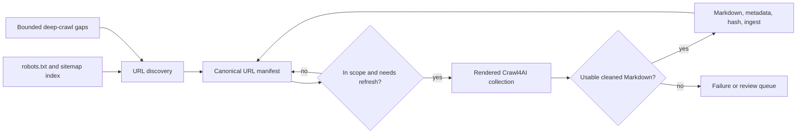

# Crawler improvements — feature specification

**Status:** Proposed

**Owner:** Finntegrate

**Related architecture:** [ADR 0003](../ADRs/0003-crawl4ai-crawler.md), [ADR 0004](../ADRs/0004-cocoindex-ingestion.md)

**Related backlog:** [#72](https://github.com/Finntegrate/tapio/issues/72) is
the canonical tracking issue for this spec's implementation. It supersedes
[#63](https://github.com/Finntegrate/tapio/issues/63) (streaming/resumability,
Requirement 3, closed) and [#64](https://github.com/Finntegrate/tapio/issues/64)
(conditional-GET revalidation, Requirement 5, closed), and is related to
[#43](https://github.com/Finntegrate/tapio/issues/43) (the broader
freshness/re-indexing umbrella this spec's crawler-side scope narrows).

## Problem statement

Tapio needs a trustworthy and reasonably complete corpus of public guidance from
Finnish government services, including Migri, Kela, Vero, DVV, and
Työmarkkinatori. The current Crawl4AI implementation intentionally limits every
site to a one-link-deep, 50-page crawl and records one site-wide successful crawl
timestamp. This is safe for a proof of concept, but it cannot cover sites whose
guidance is distributed across years of pages, arbitrary navigation depths, and
multiple language sections.

A partially collected corpus creates a material user risk: a retrieval answer may
omit relevant official guidance and appear complete. The crawler must therefore
give operators measurable coverage, controlled incremental refreshes, and a way to
exclude irrelevant or private service flows without discarding useful long-tail
guidance.

## Source survey (2026-08-04)

Before committing to a sitemap-first design, we checked `robots.txt` and
`sitemap.xml` live for all five currently configured sources, using
`curl`-verified exact counts and, for migri.fi and dvv.fi, multiple
child-sitemap samples spread across each site's full index range. The
results directly shape several requirements below: sitemap size, discovery
cost, and `lastmod` trustworthiness are not uniform across sources, and two
sources declare a `Crawl-delay` that our current configuration does not
honor.

| Source             | Sitemap                                                                   | Shape                                                                                                                                                                       | `lastmod`                                                                                                                                                                                                                                                   | Declared `Crawl-delay` |
| ------------------ | ------------------------------------------------------------------------- | --------------------------------------------------------------------------------------------------------------------------------------------------------------------------- | ----------------------------------------------------------------------------------------------------------------------------------------------------------------------------------------------------------------------------------------------------------- | ---------------------- |
| migri.fi           | `sitemap.xml` (via robots.txt)                                            | `sitemapindex` with **1,755** child sitemaps (exact count), one per Liferay page layout (`?p_l_id=...&layoutUuid=...&groupId=...`), ~4 URLs each (one per language variant) | Present and **genuinely varies** — five samples spread across the index read `2018-03-05`, `2024-12-19`, `2025-04-22`, `2026-07-08`, `2026-07-29`. The first-index entry (`2018-03-05`, the homepage layout) is the oldest, not representative of the rest. | 5s                     |
| dvv.fi             | `sitemap.xml` (via robots.txt)                                            | Same Liferay `sitemapindex`-of-layouts pattern as migri, **1,769** child sitemaps (exact count)                                                                             | Present and **genuinely varies** — three samples read `2020-10-08` (first entry, homepage layout), `2025-07-17`, and `2026-08-04` (today, at the last index entry)                                                                                          | 5s                     |
| kela.fi            | `sitemap.xml` (via robots.txt)                                            | Flat `urlset`, **3,794** URLs (exact count), single ~731 KB response, clean paths                                                                                           | Present on 3,041 of 3,794 URLs (**753 URLs — 19.8% — have no `lastmod` at all**, not merely "varying")                                                                                                                                                      | none declared          |
| vero.fi            | `sitemap.xml` (via robots.txt)                                            | Flat `urlset`, **11,185** URLs (exact count), single ~2.4 MB response, clean paths                                                                                          | Present on all 11,185 entries (0% missing), varies per URL                                                                                                                                                                                                  | none declared          |
| tyomarkkinatori.fi | **None** — no `Sitemap:` line in `robots.txt`, `/sitemap.xml` returns 404 | n/a                                                                                                                                                                         | n/a                                                                                                                                                                                                                                                         | none declared          |

Implications carried into the sections below:

- **Sitemap availability is per-source, not universal.** tyomarkkinatori.fi has
  no sitemap at all, so bounded deep-crawl cannot be a secondary "gap detector"
  for it — it is the only discovery mechanism available. Discovery mode must be
  a per-site configuration choice, not a single global sequence.
- **`lastmod` genuinely varies for migri.fi/dvv.fi, but its reliability as a
  change signal is still unverified, not disproven.** Samples spread across
  each site's full sitemap index show real variation, including a dvv.fi
  entry dated the same day as this survey. That is necessary but not
  sufficient evidence that `lastmod` tracks genuine content edits rather than
  unrelated CMS republish/workflow events — Phase 0 must still confirm the
  correlation empirically per source (for example, by comparing a `lastmod`
  change against an actual content-hash change on a sample of pages) before
  any source's `discovery.trust_lastmod` defaults to `true`. Until that
  confirmation, `trust_lastmod: false` remains the correct conservative
  default for migri.fi and dvv.fi.
- **Sitemap size ranges widely across sources** — from single flat files
  (kela.fi ~3,800 URLs, vero.fi ~11,000 URLs) to a sitemap index with
  thousands of per-layout child sitemaps (migri.fi ~1,750, dvv.fi ~1,770) —
  which shapes discovery cost and corpus scale materially; see "Scale and
  timeline" below.
- **Two of five sources declare a `Crawl-delay` our defaults don't honor.**
  Crawl4AI's built-in `check_robots_txt` option (`RobotsParser.can_fetch` in
  the installed `crawl4ai==0.9.2`) only evaluates `Allow`/`Disallow` rules — it
  does not read or enforce `Crawl-delay`, and it fails open (treats a
  robots.txt fetch error or timeout as allowed). The current
  `site_configs.yaml` and this document's own example config use
  `min_delay: 1.0`/`max_delay: 3.0` for migri, which is faster than the
  5-second delay migri.fi itself requests. See "Good-citizen crawling
  posture" below. `crawl4ai==0.9.2` is what's currently installed
  (`crawler/.venv/.../crawl4ai-0.9.2.dist-info`), not a hard pin —
  `crawler/pyproject.toml` constrains it as `>=0.9.2,<0.10`, so a future
  `uv sync` could resolve a different patch release; the behavior cited here
  should be re-checked against whatever version is actually installed at
  implementation time, not assumed to hold indefinitely.

### Scale and timeline

The counts above split into two genuinely different cost regimes rather than
one uniform "large sitemap = slow" story:

- **migri.fi and dvv.fi's cost is in enumerating the sitemap index itself**,
  not in the URL count each child sitemap returns. Because their sitemap
  index exposes ~4 URLs per HTTP request (one child sitemap per Liferay
  layout) and both sites declare a 5-second `Crawl-delay` on the same host as
  every one of those requests, enumerating the full index is a hard,
  arithmetic floor, not an estimate: 1,755 requests × 5s ≈ **2.4 hours** for
  migri.fi, 1,769 × 5s ≈ **2.5 hours** for dvv.fi — for discovery alone,
  before a single content page is rendered. This is a floor because
  `Crawl-delay` constrains successive requests to the same host regardless of
  how many are technically in flight; politeness, not our own concurrency
  setting, is what paces this. `discovery.cache_ttl_hours` (default 24h)
  matters a great deal here — this cost should be paid roughly once a day at
  most per source, not on every run.
- **kela.fi and vero.fi's discovery cost is trivial by comparison**: each
  site's full URL list is one flat `urlset` returned in a single HTTP
  response (731 KB and 2.4 MB respectively, both well under the sitemap
  protocol's 50 MB/50,000-URL ceiling). Discovery for these two sources is
  effectively one request, independent of URL count.
- **Content-rendering time, separately, is bounded below by
  `(eligible URL count) × (effective per-host delay)`**, where "eligible"
  means after functional scope filters — robots, allowed domains, content
  type, and `exclude_url_patterns` for search/login/tracking paths — are
  applied. Language is deliberately not a scope filter (see Requirement 1
  below): sites organize language variants inconsistently (path prefix,
  embedded slug, or no URL-level signal at all — see the 2026-08-05 review
  cited below), near-identical language variants are an acceptable outcome
  at crawl time, and representing them is a retrieval-layer concern, not a
  crawl-scope one. A discovery-only dry run on 2026-08-05 measured real
  eligible counts under this policy: kela.fi 3,793 of 3,794 discovered,
  vero.fi 11,180 of 11,185, migri.fi 6,952 of 6,964 (run incomplete — some
  child sitemaps failed to fetch), dvv.fi 6,460 of 6,464 (also incomplete).
  That is roughly **4–5x** the volume this section previously estimated from
  an English-only subset, and it moves the render-phase floor for migri.fi
  and dvv.fi from ~2.4–2.5h each to a back-of-envelope **~10–12.5h each** at
  their mandated 5s `Crawl-delay` floor — past "half a business day per
  source" and into multi-day territory absent concurrency (see "Operator
  controls" below). vero.fi's much larger eligible count (11,180) at a lower
  1–3s delay floor puts its own render-phase floor in a similar multi-hour
  range, so migri.fi is no longer confidently the single slowest site once
  rendering, not just discovery, is counted — this needs a render-phase
  measurement, not just the discovery-only figures above, before
  Requirement 3's streaming renderer is tuned around a "slowest site"
  assumption.
- **Actual per-page fetch latency is not the bottleneck and does not need to
  be re-measured.** ADR 0003 already measured real Crawl4AI fetch times
  against all five sites (migri 0.8s, tyomarkkinatori 0.7s, kela 1.0s, vero
  1.0s, dvv 0.7s) — an order of magnitude below any delay this spec would
  configure (1.5s+ minimum, 5s mandated for two sources). Politeness delay,
  not fetch latency, dominates wall-clock time, so that ADR 0003 measurement
  is sufficient here; re-running a live timing crawl would not materially
  change these estimates and would just add avoidable load to sites already
  flagged as WAF-sensitive (see "Legal, compliance, and site-relationship
  risk" below). A live full-content dry-run crawl is therefore not warranted
  for timeline estimation purposes.
- **The discovery-only dry run this section previously recommended as a
  Phase 0 deliverable ran on 2026-08-05** (zero page renders; sitemap parse
  only, or for tyomarkkinatori.fi a bounded deep-crawl discovery pass),
  applying only functional `exclude_url_patterns` — no `languages` or
  language-based `include_url_patterns`, which this spec no longer defines
  (see above). Total wall time for all five sites, sequential, was ~5h03m,
  matching this section's original ~5–10h sequential estimate for discovery
  alone. tyomarkkinatori.fi's pass seeded only from an English landing page
  (`https://tyomarkkinatori.fi/en`), so its 458-of-476 eligible figure
  doesn't yet reflect Finnish/Swedish content; re-seeding from a
  language-neutral landing page is open backlog work.
- **Running sites concurrently, not sequentially, bounds total wall-clock to
  the slowest single site rather than their sum.** `Crawl-delay` and
  `min_delay`/`max_delay` are enforced per host, so migri.fi's and dvv.fi's
  ~2.4–2.5h discovery floors, kela.fi's and vero.fi's near-instant discovery,
  and tyomarkkinatori.fi's bounded deep-crawl discovery do not contend with
  each other, and neither would their render-phase work. The revised, larger
  eligible-URL counts above make this more valuable than this section
  originally estimated, not less: today's CLI (`tapio_crawler.cli`) only
  crawls one configured site per invocation, and a full sequential backfill
  (discovery + render) at the volumes above is now plausibly a multi-day,
  not multi-hour, operation without it. See "Operator controls" below.

## Goals

1. Discover the public, in-scope URL inventory for every configured source without
   treating link depth as a coverage boundary.
2. Collect useful, low-boilerplate Markdown from each eligible page while avoiding
   login, transaction, search, tracking, and binary endpoints.
3. Refresh individual documents when they change, rather than treating a successful
   crawl of a site's home page as evidence that its whole corpus is current.
4. Respect robots directives and configured source boundaries, with conservative
   per-host rates and concurrency.
5. Make collection quality observable through URL-inventory coverage, result
   quality, failures, cache outcomes, and retrieval evaluations.

## Non-goals

- **Unbounded web crawling:** Tapio will not crawl the open web, external links, or
  every URL reachable from a government domain. Sitemaps and explicit scope rules
  define the intended public corpus.
- **Dropping old guidance merely because it is old:** Historical pages may be needed
  for a user whose situation began under earlier rules. Age can affect ranking or
  review priority, not automatic inclusion.
- **LLM extraction during collection:** The first version stores clean Markdown and
  deterministic metadata. Expensive semantic classification belongs in a later,
  separately evaluated pipeline.
- **Authenticated or transactional services:** The crawler must not collect pages
  requiring a login, personal data, or a state-changing interaction.
- **Automatic legal interpretation:** A larger corpus improves retrieval coverage;
  it does not change Tapio's need to cite official sources and communicate
  uncertainty.

## Design principles

1. **Sitemap-first coverage, per source.** Where a site declares a usable sitemap,
   use it as the primary URL inventory: it is independent of navigation depth and
   can provide a `lastmod` signal. Crawl4AI's `AsyncUrlSeeder` supports sitemap
   discovery and sitemap-cache validation in the version currently installed
   (0.9.2; `crawler/pyproject.toml` allows `>=0.9.2,<0.10`, so re-verify against
   whatever resolves at implementation time). This is a per-source choice, not a
   global assumption — the source survey above found one configured source
   (tyomarkkinatori.fi) with no sitemap at all, and two (migri.fi, dvv.fi) whose
   sitemap `lastmod` values vary but have not yet been confirmed to correlate
   with real content changes. Each source's discovery mode
   and its trust in `lastmod` must be set explicitly from what Phase 0 finds, not
   inherited from a shared default.
2. **Deep crawl as the discovery mechanism when no sitemap exists, otherwise a
   bounded gap detector.** For a source with a usable sitemap, use Crawl4AI BFS or
   Best-First crawling only from selected landing pages to discover legitimate
   URLs missing from that sitemap. For a source with no sitemap, the same bounded
   crawl is the primary and only discovery mechanism, so it must be enabled by
   default for that source rather than treated as optional. Either way it must
   always have domain, path, content-type, depth, and page limits.
3. **Manifest before rendering.** Maintain a durable inventory of every discovered
   URL and its collection state. Rendering is a consumer of that inventory, not the
   mechanism that defines it.
4. **Completeness before topical prioritisation.** Relevance scoring may set the
   initial rendering order, but must not permanently exclude an otherwise in-scope
   official page.
5. **Per-document freshness, with `lastmod` treated as unverified until proven
   otherwise.** Sitemap changes, HTTP validation, content hashes, and explicit
   audits decide whether a document needs work. A source's `lastmod` values may
   only drive re-rendering once discovery has confirmed they vary meaningfully
   across that source's URLs (see Requirement 2) — otherwise they are recorded for
   observability but ignored for scheduling, and freshness falls back to content
   hashing and scheduled audits alone.
6. **Safe failure semantics.** A failed freshness check or an uncertain robots
   decision must not be reported as a confirmed current document. This applies to
   Crawl4AI's own `check_robots_txt` behavior too: it evaluates `Allow`/`Disallow`
   only (not `Crawl-delay`) and fails open — treating a robots.txt fetch error or
   timeout as allowed. A `robots_policy: require` source must not inherit that
   fail-open default; an unreachable or unparseable robots.txt must block
   collection for that source until resolved, not silently proceed.
7. **Good-citizen crawling posture.** Tapio is a small, not-for-profit crawler,
   not a commercial indexing operation, and its configuration should read that
   way to the sites it collects from:
   - Identify the crawler with a descriptive `User-Agent` that names the project
     and a contact point, instead of the current default of spoofing a generic
     desktop Chrome string (`crawler/tapio_crawler/crawler/crawler.py`'s
     `_browser_config()` does not set `user_agent` today, so it inherits
     Crawl4AI's `BrowserConfig` default browser-spoofing string). A transparent
     identity lets a site operator recognize, throttle, or contact Tapio directly
     instead of only seeing anonymous browser-like traffic.
   - Treat a site's declared `Crawl-delay` as a hard floor under the configured
     `min_delay`, not a value operators must remember to match by hand. Two of
     five current sources (migri.fi, dvv.fi) declare 5 seconds; today's
     configuration runs faster than that for migri.
   - Default new sources to conservative concurrency and depth, and raise them
     deliberately per source rather than starting from a shared "fast" default.
     Even at this corpus's scale — tens of thousands of URLs across
     sources, per "Scale and timeline" — this remains a handful of government
     sites re-crawled on a slow cadence, not a commercial-scale index crawled
     continuously; there is no throughput pressure that should be traded
     against politeness. Concretely: this crawl is an out-of-band process
     expected to run at most weekly, more likely monthly, and it feeds a
     corpus meant to point users to the actual official source page(s), not
     to stand in as an authoritative knowledgebase in its own right (the chat
     product surfaces retrieved pages as sources, not as replacements for
     them). Neither a faster per-source rate nor higher concurrency than
     today's conservative defaults is needed absent a concrete requirement
     that doesn't currently exist.

## User stories

### Tapio user

- As a person seeking Finnish public-service guidance, I want answers to be based
  on the relevant official pages, including guidance that is not linked directly
  from a site's home page, so that I do not receive incomplete advice.
- As a person relying on a time-sensitive answer, I want the supporting source to
  be current or clearly dated, so that I can verify it before acting.

### Content operator

- As a content operator, I want to configure functional scope rules per source,
  so that the corpus contains public guidance but not services, navigational noise,
  or non-content endpoints — without needing to model each source's language
  structure to do it.
- As a content operator, I want to see which discovered pages were collected,
  excluded, failed, or are stale, so that I can investigate gaps without rerunning
  an entire site blindly.
- As a content operator, I want a crawl to resume safely after interruption, so
  that a large backfill does not have to restart from the beginning.

## Source and URL lifecycle



### URL manifest

The implementation must persist one record per canonical source URL. The storage
technology is an engineering decision; it must support durable updates and queries
by site, status, and next action.

| Field                                                       | Purpose                                                                                                           |
| ----------------------------------------------------------- | ----------------------------------------------------------------------------------------------------------------- |
| `site_name`, `source_url`, `canonical_url`                  | Identify the configured source and deduplicate redirects, fragments, and tracking variants.                       |
| `discovery_source`                                          | Record `sitemap`, `deep_crawl`, or an operator-provided seed.                                                     |
| `sitemap_lastmod`, `first_seen_at`, `last_seen_at`          | Support incremental discovery and removal handling.                                                               |
| `scope_status`, `scope_reason`                              | Preserve whether a URL is eligible, blocked by robots, excluded by a rule, or unsupported. |
| `fetch_status`, `last_attempt_at`, `retry_after`            | Capture successful, failed, and rate-limited collection attempts.                                                 |
| `content_hash`, `content_length`, `title`, `language`       | Detect meaningful changes and support quality reporting.                                                          |
| `last_rendered_at`, `last_ingested_at`, `extractor_version` | Decide whether rendering or ingestion is required after a configuration change.                                   |
| `cache_status`, `validation_status`                         | Distinguish a confirmed fresh cache hit from a fallback cache result.                                             |

URL identity is `(site_name, canonical_url)`: `source_url` is normalized before
comparison (lowercase scheme and host, strip default ports, drop fragments and
tracking query parameters per the source's `exclude_url_patterns`) to derive
`canonical_url`, and only `canonical_url` is unique per site — multiple
`source_url` values may point at the same manifest record. A URL discovered
before its canonical form is known (for example, before a redirect resolves)
upserts against the best `canonical_url` available at that time and merges into
the same record once resolution confirms a different canonical target, rather
than creating a second record. `discovery_source` accumulates every mechanism
that has found a URL — sitemap and deep-crawl provenance are not mutually
exclusive — instead of being overwritten by whichever ran most recently.

The manifest must retain pages absent from a later sitemap as `inactive_candidate`
for at least two discovery cycles. It must not delete previously ingested content
automatically in the first release.

Postgres/pgvector — **proposed** as the ingestion vector store in
[ADR 0004](../ADRs/0004-cocoindex-ingestion.md), not yet accepted (that ADR's
own status is `Proposed`) — is a strategic candidate for the manifest store too,
and the scale described in "Scale and timeline" above makes this a stronger,
not merely incidental, case rather than a nice-to-have consolidation:

- **The manifest needs to support real query and concurrency
  requirements, not a small lookup table.** Combining migri.fi's and dvv.fi's
  sitemap indexes alone is 3,524 layout entries covering roughly 7,000+
  language-variant URLs before scope filtering; kela.fi and vero.fi add
  3,794 and 11,185 more. Requirement 3 (manifest-driven collection and
  resumability) needs indexed queries by site, scope status, and
  next-action across a corpus in the tens of thousands of rows, concurrent
  batched jobs, and durable progress checkpoints — well past what a
  single JSON state file (today's `crawl_state.json`) or an ad hoc
  per-site flat file can support. This is a concrete reason a real
  relational store is needed from Phase 1, not deferred to later
  hardening.
- **This would not merge with CocoIndex's own incremental-processing
  state**, which ADR 0004's spike found lives in a local LMDB directory, not
  Postgres — but the manifest's per-URL scope/fetch/refresh state is a
  natural fit for the same relational store `ingest/` already proposes
  writing vectors to, and `ingest/`'s own incremental logic could then read
  canonical URLs and content hashes from it directly instead of re-deriving
  them from Markdown frontmatter.

If Phase 1 engineering settles on Postgres for the manifest, it should be
recorded as a new, unifying ADR that reconciles the crawler manifest and ADR
0004's ingestion store under one storage decision — and, since ADR 0004 itself
is still `Proposed`, that unifying ADR is also an opportunity to move ADR 0004
from Proposed to Accepted on the strength of a second, independent consumer
(the crawler manifest) needing the same store, rather than deciding storage as
an implementation detail buried in this spec.

## Configuration contract

The existing conservative fields (`max_depth`, `max_pages`, delays, concurrency,
and content-selection overrides) remain supported during migration. The new schema
adds explicit discovery, scope, refresh, and politeness settings. Field names
below are the target configuration contract; the implementation may stage them
behind backwards compatible Pydantic aliases.

Requirement 3's per-job cap and per-source batch limit, and Requirement 6's
coverage target, are not all per-site YAML fields. The per-job URL cap
(`--max-urls`, default 5,000) and per-source batch size (`--batch-size`,
default 500) bound one CLI invocation rather than describe a source, so they
are runtime flags with defaults, not config; an explicit flag overrides the
default for that invocation only. The coverage target is per-site because an
acceptable coverage ratio varies by source, so it is a config field —
`refresh.coverage_target_percent` (default 95, matching the "Eligible-document
coverage" success metric) — evaluated after a run completes, with no CLI
override.

`discovery.source` and `discovery.trust_lastmod` are per-site, not global — see
the source survey above. `migri` illustrates a source with a usable-but-untrusted
sitemap; `tyomarkkinatori` illustrates a source with none.

```yaml
sites:
  migri:
    base_url: "https://migri.fi"
    description: "Finnish Immigration Service website"
    crawler_config:
      robots_policy: require
      politeness:
        # Effective min_delay is max(min_delay, robots Crawl-delay) once the
        # crawl run has read migri.fi's robots.txt (5s, per the source survey).
        # This field documents that floor; it is not itself the enforcement
        # mechanism — see Requirement 1.
        respect_crawl_delay: true
        user_agent: "TapioBot/1.0 (+https://github.com/Finntegrate/tapio; nonprofit immigration-guidance assistant; contact via repository)"
      discovery:
        source: sitemap
        sitemap_urls: [] # Empty: read Sitemap entries from robots.txt
        cache_ttl_hours: 24
        validate_sitemap_lastmod: true
        # migri.fi's sitemap is a sitemapindex of 1,755 per-layout child
        # sitemaps whose lastmod varies, per the source survey, but is not
        # yet confirmed to track real content edits. Discovery must not
        # schedule re-renders from lastmod alone until Phase 0 confirms
        # that correlation for this source.
        trust_lastmod: false
      scope:
        allowed_domains: ["migri.fi", "www.migri.fi"]
        exclude_url_patterns:
          - "*/search*"
          - "*/login*"
          - "*/asiointi*"
          - "*?*utm_*"
        allowed_content_types: ["text/html"]
      gap_crawl:
        enabled: true
        seed_urls: ["https://migri.fi"]
        strategy: bfs
        max_depth: 3
        max_pages: 300
      refresh:
        unchanged_audit_days: 90
        inactive_grace_cycles: 2
      minimum_content_length: 100
      word_count_threshold: 20
      min_delay: 5.0
      max_delay: 8.0
      max_concurrent: 2

  tyomarkkinatori:
    base_url: "https://tyomarkkinatori.fi"
    description: "Work assistance and employment services website"
    crawler_config:
      robots_policy: require
      politeness:
        respect_crawl_delay: true
        user_agent: "TapioBot/1.0 (+https://github.com/Finntegrate/tapio; nonprofit immigration-guidance assistant; contact via repository)"
      discovery:
        # No Sitemap: entry in robots.txt and /sitemap.xml returns 404, per
        # the source survey. Bounded deep crawl is the only discovery path
        # for this source, so gap_crawl is required, not a P1 add-on.
        source: none
      scope:
        allowed_domains: ["tyomarkkinatori.fi"]
        exclude_url_patterns:
          - "*/search*"
          - "*/login*"
          - "*?*utm_*"
        allowed_content_types: ["text/html"]
      gap_crawl:
        enabled: true
        seed_urls: ["https://tyomarkkinatori.fi"]
        strategy: bfs
        max_depth: 4
        max_pages: 300
      refresh:
        unchanged_audit_days: 90
        inactive_grace_cycles: 2
      minimum_content_length: 100
      word_count_threshold: 20
      min_delay: 1.0
      max_delay: 3.0
      max_concurrent: 3
```

Scope configuration is intentionally functional only — allowed domains, content
type, and `exclude_url_patterns` for search/login/tracking/transactional paths —
with no `languages` or language-based `include_url_patterns` field. The
2026-08-05 discovery review (see "Scale and timeline" above) found language
organized inconsistently across sources — path prefix on vero.fi/migri.fi/dvv.fi
(and not even a consistent prefix: dvv.fi uses `/se/` for Swedish, not `/sv/`),
embedded directly in the URL slug with no path signal at all on kela.fi — so a
per-source language allow-list would need per-source, frequently-wrong detection
logic to enforce something the corpus doesn't need enforced: near-identical
language variants of the same page are an acceptable, expected outcome of a
comprehensive crawl. Every source is crawled comprehensively, and
language-aware deduplication, ranking, and presentation are retrieval-layer
concerns (see [#68](https://github.com/Finntegrate/tapio/issues/68)), not a
crawl-time filter.

`min_delay`/`max_delay` above are illustrative starting points, not settled
values — the actual safe rate per source is an open question below. What the
migri example is meant to show is the _relationship_: its configured `min_delay`
must not be set below its declared `Crawl-delay` (5s), whatever the final chosen
value is, whereas tyomarkkinatori (no declared `Crawl-delay`) keeps today's more
conservative-by-convention default rather than being sped up just because nothing
declares a floor.

## Requirements

### Must-have (P0)

#### 1. Source policy and scope enforcement

- Enable Crawl4AI robots checking (`check_robots_txt`) for every production
  collection request. Crawl4AI's own `RobotsParser.can_fetch` only evaluates
  `Allow`/`Disallow` and fails open on a fetch error or timeout — a
  `robots_policy: require` source must wrap that behavior so an unreachable or
  unparseable robots.txt blocks collection for that source instead of silently
  proceeding.
- Parse the declared `Crawl-delay` for each source's `robots.txt`, where
  present, and enforce it as a floor under that source's configured
  `min_delay`/`max_delay` rather than trusting operators to set delays that
  happen to already comply. Two of five current sources (migri.fi, dvv.fi)
  declare 5 seconds.
- When the declared `Crawl-delay` also exceeds the source's configured
  `max_delay`, raise the effective maximum to at least the effective minimum
  before constructing Crawl4AI's `mean_delay`/`max_range` jitter window
  (`max_range` is `max_delay - min_delay` and must never be negative), or
  disable jitter for that host and use a fixed per-host delay equal to
  `Crawl-delay`. This raised-effective-maximum behavior only applies to a
  successfully parsed `Crawl-delay`; a malformed or unparseable value still
  falls back to the source's configured `min_delay` unchanged, not this
  adjustment.
- Enforce that floor through one shared per-host rate limiter covering every
  request type against that host — robots.txt and sitemap fetches, gap-crawl
  discovery, page rendering, redirect follows, and retries — not a limiter
  scoped to rendering alone. Crawl4AI's `AsyncUrlSeeder` (sitemap discovery)
  and `AsyncWebCrawler` (rendering) are separate mechanisms and must be wired
  to share this state, which matters more once sites run concurrently (see
  "Operator controls"). When a `robots.txt` declares more than one
  `Crawl-delay` stanza, the directive for our own `User-Agent` takes
  precedence over a wildcard (`*`) stanza; a malformed or unparseable
  `Crawl-delay` value is ignored in favor of the source's configured
  `min_delay`, not treated as a fetch failure.
- Treat a `429` or `503` response's `Retry-After` header as extending the same
  per-host limiter for every pending and future request to that host, not
  only the retry of the URL that received it, with exponential backoff
  between successive retries of the same URL and a per-URL retry cap after
  which the URL is marked failed rather than retried indefinitely. Parse
  `Retry-After` as either delay-seconds or an HTTP-date per RFC 9110; a
  missing or unparseable value falls back to exponential backoff from the
  configured `max_delay` instead. Cap the resulting per-host suspension at a
  configured maximum (default 1 hour), including a `Retry-After` far enough
  in the future to exceed it; a run that hits the cap marks the affected
  URLs `incomplete` for that run rather than suspending the host
  indefinitely.
- Send a descriptive, project-identifying `User-Agent` (see "Good-citizen
  crawling posture") instead of Crawl4AI's default browser-spoofing string, so
  a source operator can recognize and, if needed, specifically rate-limit or
  contact the crawler.
- Fetch and retain the discovered `robots.txt` and sitemap URLs as crawl-run
metadata.
- Reject URLs outside configured allowed domains, permitted content types, or
explicit deny patterns before rendering.
- Exclude URL fragments and normalize tracking parameters before manifest lookup.
- Use same-site redirects only when the redirect target remains within the allowed
domains and scope.

##### Source policy acceptance criteria

- [ ] Given a URL is disallowed by `robots.txt`, when discovered, then it is marked
  `blocked_robots` and is not rendered.
- [ ] Given a URL points to an external domain, login flow, configured service path,
  or non-HTML asset, when discovered, then it is recorded with an exclusion reason
  and is not rendered.
- [ ] Given a redirect leaves the permitted domain set, when rendering begins, then
  the result is rejected and cannot enter the content corpus.
- [ ] Given a source's `robots.txt` declares a `Crawl-delay` greater than its
  configured `min_delay`, when a crawl run starts, then the effective delay used
  is the declared `Crawl-delay`, not the configured value.
- [ ] Given `robots_policy: require` and a robots.txt fetch fails or times out,
  when a crawl run starts for that source, then collection does not proceed and
  the run is marked `incomplete`, not silently allowed.
- [ ] Given any production request, when it reaches a source's server, then its
  `User-Agent` identifies the project rather than spoofing a generic browser.
- [ ] Given a source returns `429` or `503` with a valid `Retry-After` header
  within the configured cap, when the next request to that host is scheduled
  — whether a robots/sitemap fetch, a render, or a retry — then it honors
  `Retry-After` as the per-host floor, not just a per-URL retry delay.
- [ ] Given a `Retry-After` header is missing or unparseable, when the next
  request to that host is scheduled, then exponential backoff from the
  configured `max_delay` is used instead, not a hang or an unbounded default.
- [ ] Given a `Retry-After` value exceeds the configured per-host suspension
  cap, when the cap is reached, then the affected URLs are marked
  `incomplete` for that run rather than the host being suspended
  indefinitely.

#### 2. Sitemap-first discovery and manifest persistence

- Read `discovery.source` per site (`sitemap` or `none`) rather than assuming
  every source has a usable sitemap. A source configured with `source: none` (for
  example tyomarkkinatori.fi, which declares no `Sitemap:` in `robots.txt` and
  returns 404 for `/sitemap.xml`) must run bounded deep crawl (the gap-crawl
  mechanism described under "Bounded deep-crawl gap detection" below, promoted
  to required for that source) as its primary discovery path, not skip
  discovery entirely.
- For a source with `source: sitemap`, discover sitemap locations from
  `robots.txt`, including sitemap indexes and child sitemaps. Some sources
  (migri.fi: 1,755; dvv.fi: 1,769) expose the sitemap index itself as
  thousands of child sitemap URLs sharing one path with different query
  parameters — discovery must handle that shape, and its run summary must
  report how many child sitemaps were fetched, since that count is itself a
  meaningful cost (see "Scale and timeline"). Other sources (kela.fi, vero.fi)
  expose their full URL list as a single flat `urlset` response — discovery
  must not assume every sitemap is index-shaped, and must not conflate "many
  URLs in a sitemap" with "many requests to discover them," since these are
  two independent costs that happen to coincide only for migri.fi/dvv.fi.
- Use Crawl4AI's sitemap seeding capability with source `sitemap`, not Common
  Crawl, and cache sitemap results for a configurable period with `lastmod`
  validation enabled.
- Before trusting a source's `lastmod` values for refresh scheduling
  (Requirement 5), check both that they vary meaningfully across that source's
  discovered URLs _and_ that the variation correlates with real content
  changes, not just CMS republish/workflow noise. migri.fi and dvv.fi pass the
  first check (their `lastmod` does vary, confirmed by broad sampling) but not
  yet the second — that correlation is unverified, not disproven, and remains
  a Phase 0 deliverable per source. Until a source passes both checks, record
  `lastmod` for observability only and set that source's `discovery.trust_lastmod`
  to `false`, falling back to content hashing and scheduled audits for
  freshness. Promotion to `trust_lastmod: true` requires a recorded
  measurement, not a qualitative judgment: for a random sample of at least 50
  URLs (or the full eligible set if smaller), observed across a window
  spanning at least one `discovery.cache_ttl_hours` cycle plus one subsequent
  scheduled audit, at least 10 of the sampled URLs must show a `lastmod`
  change during that window — a window with too few `lastmod` changes to
  evaluate does not count as a pass, however high the resulting percentage
  looks. Given that minimum is met, correlation must hold in both
  directions: at least 90% of URLs whose `lastmod` changed must show a
  corresponding `content_hash` change (catching a `lastmod` that fires
  without a real content change), and at least 90% of URLs whose
  `content_hash` changed must show a corresponding `lastmod` change (catching
  a `lastmod` that misses a real content change, which would silently
  suppress a needed re-render). The sample size, window, and both
  directional pass/fail results must be recorded against that source's entry
  in the source survey before its `trust_lastmod` config changes. A source
  that does not meet the minimum-changed-sample count and both correlation
  thresholds stays at `trust_lastmod: false` and continues on
  `unchanged_audit_days` and content hashing, regardless of how strongly its
  `lastmod` values appear to vary.
- Upsert all discovered URLs into the manifest before any full-page rendering.
- Preserve discovery provenance and sitemap `lastmod` where supplied.

##### Discovery acceptance criteria

- [ ] Given a sitemap has pages at arbitrary directory depth, when discovery runs,
  then eligible URLs are present in the manifest regardless of navigation depth.
- [ ] Given the same URL appears in more than one sitemap, when discovery completes,
  then it has one manifest record with all relevant provenance retained or
  deterministically merged.
- [ ] Given a sitemap cannot be fetched or parsed, when discovery completes, then
  the run is marked incomplete and does not claim complete source coverage.
- [ ] Given a source configured with `discovery.source: none`, when discovery
  runs, then bounded deep crawl executes as the primary discovery path and the
  run summary does not report the source as sitemap-incomplete.
- [ ] Given a source's sitemap resolves through a sitemap index with thousands of
  child sitemaps, when discovery completes, then the run summary reports the
  number of child sitemaps fetched, distinct from the number of content URLs
  discovered.
- [ ] Given a source's `lastmod` values are identical or non-varying across a
  sample of its discovered URLs, when discovery completes, then that source is
  flagged as `trust_lastmod: false` and its freshness decisions do not rely on
  `lastmod` alone.
- [ ] Given a source's `lastmod` values do vary across a sample of its
  discovered URLs but their correlation with real content changes has not been
  empirically confirmed (migri.fi and dvv.fi today), when discovery completes,
  then that source is still flagged as `trust_lastmod: false` until Phase 0
  confirms the correlation — variation alone does not earn trust.

#### 3. Manifest-driven collection and resumability

This requirement's streaming/resumability behavior supersedes the now-closed
[#63](https://github.com/Finntegrate/tapio/issues/63) ("Stream Crawl4AI
results so long crawls retain completed pages"), filed before this spec
existed. Implementation is tracked under the canonical
[#72](https://github.com/Finntegrate/tapio/issues/72); see "Related backlog"
near the top of this document.

- Render only manifest records whose scope is eligible and whose refresh policy says
  they need work.
- Process records in bounded batches with Crawl4AI streaming, preserving per-host
  delay and concurrency settings.
- Persist progress after each completed URL and allow a stopped run to resume from
  its pending set without repeating completed work unnecessarily.
- Maintain a hard cap per job and a configurable per-source batch limit; a full
  corpus may span multiple jobs.

##### Resumability acceptance criteria

- [ ] Given a backfill is interrupted, when it resumes, then previously successful
  URLs are not rendered again unless their refresh policy requires it.
- [ ] Given a source has more eligible URLs than a job limit, when the job ends,
  then the remaining URLs stay pending and are selected by a later job.
- [ ] Given a page returns 429 or 5xx, when collection records the result, then the
  URL receives a retry schedule and the crawl continues with other eligible URLs.

#### 4. Content selection and document quality

- Continue using generic chrome removal (`nav`, `header`, `footer`, and `form`) and
  `PruningContentFilter` as the default extraction policy.
- Apply a configurable `word_count_threshold` in addition to the existing minimum
  Markdown length check.
- Retain per-site `css_selector` and `target_elements` only as measured escape
  hatches. A selector override must preserve the near-empty fallback behavior.
- Store title, canonical source URL, collection timestamp, content hash, language,
  and extractor version in document metadata.
- Key each document's persisted artifact off the manifest identity
  `(site_name, canonical_url)` (see "URL manifest" above), not `source_url` —
  today, `crawler.py`'s `_filename` derives a `source_url`-keyed SHA-256
  digest, which produces a different file for two `source_url`s that resolve
  to the same canonical page. When a redirect resolves or a canonical merge
  changes a record's `canonical_url` after an artifact already exists under
  the old key, atomically rename the artifact to the new key or remove the
  obsolete alias, so each manifest record has exactly one current Markdown
  file, never both the old and new artifact at once.

##### Content quality acceptance criteria

- [ ] Given a manifest record's `canonical_url` changes after its artifact was
  already written under a prior key, when the next successful render
  completes, then exactly one current Markdown file exists for that record
  and the prior key's file is gone or renamed, not left as an orphan.
- [ ] Given a selector or cleanup rule produces near-empty Markdown, when the
  fallback render succeeds, then the fallback result is saved and the recovery is
  reported.
- [ ] Given a page contains only repeated navigation or insufficient body text, when
  it is rendered, then it is reported as low quality and is not ingested as a normal
  guidance document.
- [ ] Given unchanged cleaned content is rendered with a new extractor version, when
  the document is written, then its metadata makes the extraction change visible.

#### 5. Per-document cache and refresh policy

This requirement's freshness behavior supersedes the now-closed
[#64](https://github.com/Finntegrate/tapio/issues/64) ("Revalidate due pages
with conditional HTTP requests"), which proposed ETag/`If-None-Match`
conditional GETs — a different mechanism from the `CacheMode`/
`check_cache_freshness` approach specified below. If both are pursued, they
compose (conditional GET as a cheaper pre-check before a full Crawl4AI
cache-freshness validation), but that composition is not yet decided and
should be resolved during Phase 2, not assumed. Implementation is tracked
under the canonical [#72](https://github.com/Finntegrate/tapio/issues/72).
[#43](https://github.com/Finntegrate/tapio/issues/43) ("Knowledge base
freshness and scheduled re-indexing") remains the broader, still-open
umbrella issue this entire requirement (and much of this spec) elaborates;
see "Related backlog" near the top of this document.

- For an initial backfill and a URL known to have changed, use
  `CacheMode.WRITE_ONLY` so the rendered result refreshes Crawl4AI's durable cache.
- For an unchanged document's scheduled check, use `CacheMode.ENABLED` with
  `check_cache_freshness=True`.
- Treat Crawl4AI cache-validation fallback (`hit_fallback`) as unconfirmed. It must
  schedule a retry and must not advance the document's confirmed-current timestamp.
- Use `READ_ONLY` only for reproducible local tests and `BYPASS` only for live
  diagnostics that must not alter cache state.
- Re-ingest a document only when its cleaned-content hash or extractor version
  changes.
- Only use sitemap `lastmod` to trigger a re-render for a source whose
  `discovery.trust_lastmod` is `true` (Requirement 2). For a source where it is
  `false` (migri.fi and dvv.fi today — their `lastmod` does vary, per the
  source survey, but has not yet been shown to correlate with real content
  changes), rely on `unchanged_audit_days` and content hashing instead,
  until Phase 0 confirms that correlation and flips `trust_lastmod` to `true`.

##### Refresh policy acceptance criteria

- [ ] Given a source's `discovery.trust_lastmod` is `true` and a sitemap `lastmod`
  is newer than the last successful render, when the collector selects work, then
  the URL is re-rendered with a write-only cache mode.
- [ ] Given a source's `discovery.trust_lastmod` is `false`, when the collector
  selects work, then sitemap `lastmod` is not used to trigger a re-render, and the
  source's `unchanged_audit_days` schedule governs refresh instead.
- [ ] Given HTTP freshness validation confirms a cached document, when the job
  completes, then the manifest records a confirmed validation without a browser
  render.
- [ ] Given freshness validation fails due to a network error, when the cache is
  served as a fallback, then the manifest records `unconfirmed` and schedules a
  retry.
- [ ] Given a refreshed page has the same cleaned-content hash and extractor
  version, when collection completes, then no duplicate ingest operation occurs.

#### 6. Coverage and quality observability

- Assign each crawl job a stable `run_id` at start, and record `site_name`,
  `phase` (discovery or render), and completion state (`complete`,
  `incomplete`, `failed`) against that `run_id`. Produce one run summary per
  `(run_id, source)` pair and persist it alongside the manifest state as of
  that run's completion — a specific manifest snapshot or version, not "the
  manifest" as a shifting whole.
- Compute every count below — discovered, eligible, excluded by reason,
  queued, rendered, saved, low-quality, failed, retried, inactive-candidate,
  ingested, and the coverage ratio — exclusively from the manifest snapshot
  tied to that run's `run_id`, so a resumed run or a concurrent run against a
  different site (see "Operator controls") cannot mix records between
  summaries. A run whose discovery phase failed is recorded with completion
  state `incomplete`, not counted toward coverage.
- Report discovered, eligible, excluded by reason, queued, rendered, saved,
  low-quality, failed, retried, inactive-candidate, and ingested URL counts.
- Report HTTP-status and cache-status distributions, including validated hits and
  fallback hits.
- Provide a coverage ratio of eligible manifest URLs that have a successful current
  document, alongside an explicit `incomplete` state when discovery failed.

##### Observability acceptance criteria

- [ ] Given a run finishes, when an operator views its summary, then they can tell
  whether source discovery completed and which URLs still need action.
- [ ] Given a source's coverage falls below its configured target, when the summary
  is produced, then it is visibly flagged for review.

### Nice-to-have (P1)

#### Bounded deep-crawl gap detection

This section describes deep crawl **as a supplement to sitemap discovery**, for
sources that have a usable sitemap. It is genuinely P1 for those sources. It is
**not** P1 for a source configured with `discovery.source: none` (currently
tyomarkkinatori.fi) — for that source the same bounded-crawl mechanism is the
only discovery path and is required from Phase 1, per Requirement 2.

- Run BFS from curated public landing pages after sitemap discovery, with
  `DomainFilter`, `URLPatternFilter`, `ContentTypeFilter`, `max_depth`, and
  `max_pages` configured per source.
- Add newly discovered, eligible URLs to the manifest with `deep_crawl` provenance.
- Use Best-First scoring to prioritise initial processing, not to suppress eligible
  records permanently.

#### Retrieval-quality evaluation

- Maintain a small, versioned set of representative questions for permits,
  benefits, employment, taxation, and population services.
- Measure source coverage, citation quality, retrieval rank, and boilerplate rate
  after each full-source backfill.

#### Operator controls

- Support explicit pause, cancellation, retry, and source-level backfill controls.
- Surface Crawl4AI deep-crawl checkpoint state for long-running jobs.
- Run multiple configured sites concurrently as independent jobs, each using
  its own per-host politeness and concurrency settings (Design Principle 7).
  Site-level concurrency needs no cross-site throttling, since `Crawl-delay`
  and `min_delay`/`max_delay` are enforced per host — see "Scale and
  timeline" above for the resulting wall-clock reduction.
- Give each concurrent site job its own live CLI progress indicator (for
  example, one progress bar per site showing discovery/rendering phase,
  counts, and current delay), replacing today's single printed summary line
  per invocation. Each concurrent site needs its own Crawl4AI browser
  instance, which has a real memory/CPU cost that scales with the number of
  sites run at once — this should be measured before defaulting to "all
  sites concurrently" in constrained environments such as CI or a small
  deployment host.

### Future considerations (P2)

- Parse published PDFs and other official document formats through a dedicated,
  tested document pipeline.
- Detect substantive content changes versus template-only changes.
- Add site-specific hydration, iframe, or shadow-DOM settings only after a measured
  source-quality failure.
- Add semantic classification for topic, effective date, and audience, evaluated
  separately from crawling.
- Support source-level archival and document removal after a reviewed retention and
  citation policy exists.

## Legal, compliance, and site-relationship risk

[ADR 0003](../ADRs/0003-crawl4ai-crawler.md) recorded migri.fi as WAF-blocked
when crawled through Cloudflare's shared infrastructure (reachable only when
crawled directly, with no guarantee that remains true as volume grows), and
"Scale and timeline" above establishes that discovery and a full backfill
together mean roughly an order of magnitude more requests than a single-page
reachability check. A spec proposing that request volume against exactly the
sites already flagged as block-sensitive needs more than one row in the Open
Questions table.

- **This spec does not, by itself, resolve whether increased crawl volume is
  safe to run against migri.fi and dvv.fi in production.** ADR 0003's own
  Risks section already named this ("direct-IP crawling may draw its own
  blocks over time... today's success is not a durable guarantee"). Phase 0
  must include a volume-aware check — not just "can we reach the site," which
  ADR 0003 already confirmed, but "does sustained crawling at this spec's
  scale (thousands of requests per source) draw a block that front-page
  testing did not."
- **`robots_policy: require` and the `Crawl-delay` floor (Design Principle 7,
  Requirement 1) are this spec's primary technical mitigation**, but they are
  a politeness commitment, not a legal or contractual one. What policy governs
  crawling Finnish government sites beyond robots.txt compliance — Terms of
  Service, any AI-specific content-use signals, or sector-specific public-data
  reuse rules — is still the open, blocking question in the table below; this
  section does not resolve it, it makes explicit that resolving it now carries
  more weight given the volume this spec proposes.
- **A block or rate-limit response at production scale must fail safe, not
  fail silent.** Requirement 1's fail-closed handling for an unreachable
  `robots.txt`, and Requirement 6's coverage observability, together mean a
  sustained block should surface as an incomplete/flagged run an operator can
  see — not as a partial, silently-accepted corpus that looks complete.
- **Non-goals** already excludes unbounded crawling and authenticated/
  transactional pages; this section does not expand scope, it makes the
  existing politeness and legal open questions load-bearing for a
  go/no-go decision before Phase 1 begins, rather than something to revisit
  only if a block is observed in production.

## Success metrics

No dependable baseline exists yet. Establish a baseline during the first two source
backfills, then evaluate these targets per production source.

| Metric                         | Initial target                                                                                                                                           | Measurement                   |
| ------------------------------ | -------------------------------------------------------------------------------------------------------------------------------------------------------- | ----------------------------- |
| Sitemap discovery completeness | 100% of parseable sitemap URLs are classified in the manifest                                                                                            | Discovery run summary         |
| Eligible-document coverage     | >=95% of eligible manifest URLs have a successful current document                                                                                       | Manifest query after backfill |
| Extraction quality             | >=90% of successful renders meet the configured content threshold without fallback                                                                       | Collection summary            |
| Freshness confidence           | 100% of documents marked current are either newly rendered or explicitly freshness-validated                                                             | Manifest audit                |
| Refresh efficiency             | >=80% of unchanged scheduled documents avoid a browser render through confirmed validation                                                               | Cache-status summary          |
| Retrieval coverage             | Representative evaluation questions retrieve at least one relevant official source in the top results                                                    | Versioned evaluation suite    |
| Politeness                     | 0 sustained rate-limit incidents attributable to exceeding configured host rates, and 0 requests sent to a source faster than its declared `Crawl-delay` | HTTP status and retry logs    |

## Dependencies and phasing

| Phase                          | Scope                                                                                                                                                                                                                                                                   | Dependencies                                     |
| ------------------------------ | ----------------------------------------------------------------------------------------------------------------------------------------------------------------------------------------------------------------------------------------------------------------------- | ------------------------------------------------ |
| **0 — policy and spike**       | Confirm functional exclude-pattern rules, safe per-source request rates, and sample extraction quality for all five sources, building on the 2026-08-04 source survey and 2026-08-05 discovery review above (robots/sitemap/`Crawl-delay` already checked live for migri, kela, vero, dvv, tyomarkkinatori) | Product, legal/compliance, source review         |
| **1 — inventory foundation**   | Manifest storage, sitemap-first discovery, source scope configuration, summary reporting                                                                                                                                                                                | Crawler configuration and durable storage choice |
| **2 — controlled backfill**    | Manifest-driven streaming renderer, document hashing, cache/refresh policy, resumability                                                                                                                                                                                | Phase 1 and ingest idempotency                   |
| **3 — quality and gaps**       | Bounded deep-crawl gap detection, retrieval evaluation, operator controls                                                                                                                                                                                               | Phase 2 metrics and review                       |
| **4 — incremental operations** | Scheduled per-document refreshes, inactive-candidate review, production dashboards                                                                                                                                                                                      | Stable baseline from Phase 2                     |

## Open questions

| Question                                                                                                                                                                                                                                                                                                                                                                                                    | Owner                               | Blocking?                                             |
| ----------------------------------------------------------------------------------------------------------------------------------------------------------------------------------------------------------------------------------------------------------------------------------------------------------------------------------------------------------------------------------------------------------- | ----------------------------------- | ----------------------------------------------------- |
| How should near-identical language variants of the same page be represented in retrieval — deduplicated, ranked, or surfaced separately? Crawl-time scope no longer filters by language (resolved 2026-08-06: every discovered language variant is crawled), so this is now purely a retrieval-layer question, tracked in [#68](https://github.com/Finntegrate/tapio/issues/68).                                                                                                                                                                                                                                                               | Product and data                    | No — crawl-time policy resolved; open at retrieval time |
| What policy governs robots directives, AI-specific content signals, and any source terms that go beyond robots?                                                                                                                                                                                                                                                                                             | Legal/compliance and product        | Yes, before production backfill                       |
| Where should the manifest live, and what retention/backup policy applies to crawl metadata? Resolved for the near term (2026-08-06): SQLite, not Postgres — there is no operating budget for a persistent Postgres service, and SQLite is portable (copy the file to a shared bucket), the same pattern likely to be used for the RAG database if it moves to a live demo environment. Concurrent multi-site writes (see "Operator controls" and #79) need WAL mode and a busy-timeout on the existing SQLite connection, not a database migration. Revisit only if a live-demo scaling problem — the same kind that would push ChromaDB toward a cloud vector store — makes it necessary. | Engineering and data                | No — resolved; revisit only if scale/budget changes   |
| What is the safe production request rate and concurrency for each source, above the `Crawl-delay` floor the source survey already found for migri.fi and dvv.fi (5s)? Resolved (2026-08-06): today's conservative defaults stand, no faster rate or higher concurrency needed. This crawl is an out-of-band process run at most weekly, more likely monthly — not a live-traffic path — and it feeds a corpus meant to point users to official source pages, not to serve as an authoritative knowledgebase in its own right (see "Good-citizen crawling posture" above). There is no throughput requirement pushing against the existing politeness floor. | Engineering, informed by Phase 0    | No — resolved; revisit only if crawl cadence or product design changes |
| Which URL query parameters are meaningful rather than tracking-only for each site?                                                                                                                                                                                                                                                                                                                          | Engineering and content operations  | No — begin conservatively and add reviewed exceptions |
| What threshold distinguishes an inactive page from a removed source that should no longer be cited?                                                                                                                                                                                                                                                                                                         | Product, legal/compliance, and data | No — retain inactive candidates in v1                 |

## Technical references

- [Crawl4AI deep crawling](https://docs.crawl4ai.com/core/deep-crawling/)
- [Crawl4AI content selection](https://docs.crawl4ai.com/core/content-selection/)
- [Crawl4AI cache modes](https://docs.crawl4ai.com/core/cache-modes/)
- [Crawl4AI URL seeding](https://docs.crawl4ai.com/core/url-seeding/#1-sitemaps-fastest)
- Source survey (2026-08-04): live `robots.txt`/`sitemap.xml` checks against
  migri.fi, kela.fi, vero.fi, dvv.fi, and tyomarkkinatori.fi, using exact
  `curl`-based counts and per-index sampling for migri.fi/dvv.fi — see
  "Source survey" and "Scale and timeline" above — plus verification of
  `AsyncUrlSeeder`/`SeedingConfig`, `CacheMode`, `RobotsParser.can_fetch`, and
  `BrowserConfig.user_agent` behavior against the installed `crawl4ai==0.9.2`
  package (`crawler/.venv/lib/python3.14/site-packages/crawl4ai/`).
- Discovery-only dry run (2026-08-05): `discover`-only (zero page renders) run
  against all five configured sites, providing the real eligible-URL counts
  and per-site language-path structure cited in "Scale and timeline" above —
  the basis for dropping `languages`/language-based `include_url_patterns`
  from scope configuration.
- [ADR 0003](../ADRs/0003-crawl4ai-crawler.md)'s per-page Crawl4AI fetch-time
  measurements (migri 0.8s, tyomarkkinatori 0.7s, kela 1.0s, vero 1.0s, dvv
  0.7s), reused directly in "Scale and timeline" above rather than
  re-measured, since they are well below any delay this spec would configure.
